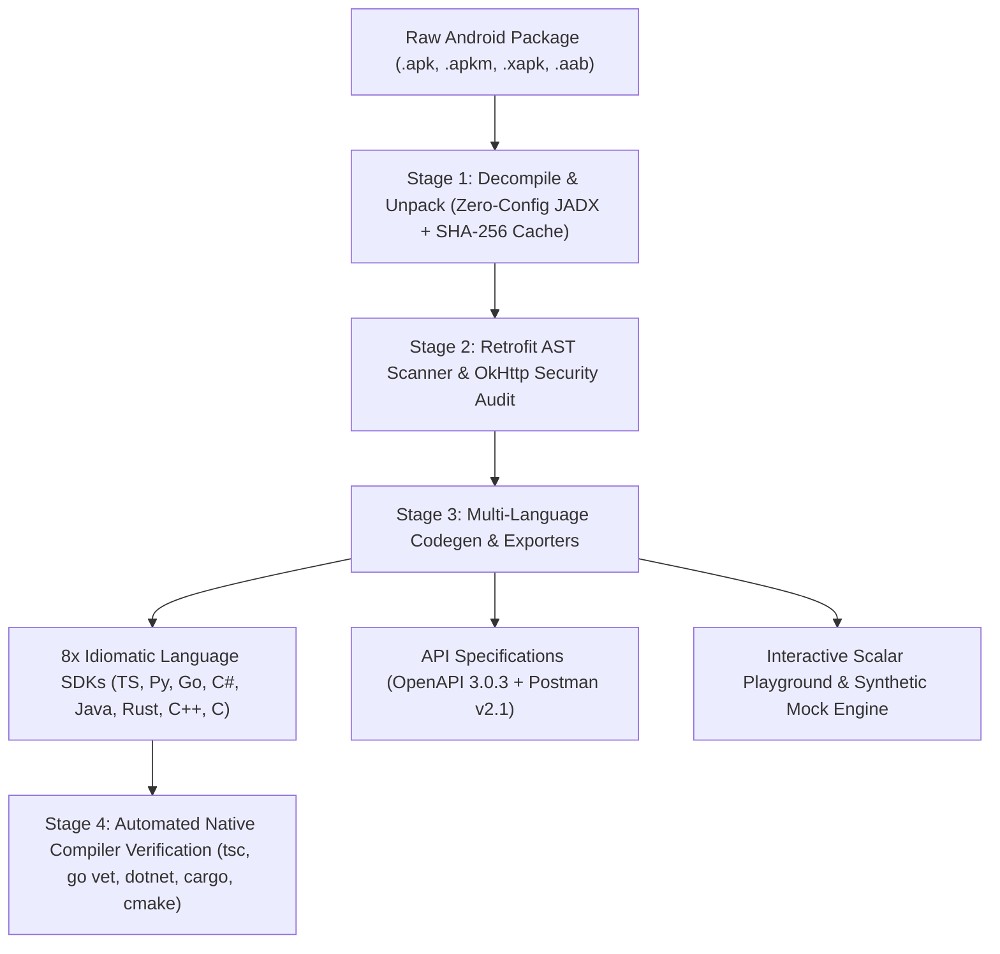

# 🚀 retrofit-sdk-gen

> **Universal Android Retrofit to Multi-Language SDK & API Tooling Generator.**  
> Turn any raw Android package (`.apk`, `.apkm`, `.xapk`, `.aab`) or decompiled Java/Kotlin sources into a production-grade SDK in **8 languages**, an OpenAPI 3.0 specification, a Postman Collection, an interactive API Playground, and an API Changelog in seconds.

[](https://www.npmjs.com/package/retrofit-sdk-gen)
[](https://opensource.org/licenses/MIT)
[](https://www.typescriptlang.org/)
[](https://python.org/)
[](https://go.dev/)
[](https://dotnet.microsoft.com/)
[](https://www.oracle.com/java/)
[](https://www.rust-lang.org/)
[](https://isocpp.org/)
[](https://en.wikipedia.org/wiki/C99)
[](docs/benchmarks.md)
[](https://github.com/chahakshahcs5/retrofit-sdk-gen/actions)

---

## 🧪 Verified Against Real-World Android APKs

`retrofit-sdk-gen` is validated against authentic Android applications built with Retrofit 2 + OkHttp. Every release undergoes 4-stage automated reverse-engineering, multi-language generation, and **native compilation** using official language toolchains (`tsc`, `python -m compileall`, `go vet`, `dotnet build`, `javac`, `cargo check`, and Visual Studio `cmake` / MSVC / GCC):

| Target Application | Architecture / Domain | Endpoints | Data Models | OkHttp Interceptors | Language Compilers (TS, Py, Go, C#, Java, Rust, C++, C) | Live Mock Ping | Status |
| :--- | :--- | :---: | :---: | :---: | :---: | :---: | :---: |
| **[ShopFlow](examples/shopflow)** | E-Commerce Storefront (`dummyjson.com`) | **8** | **7** | **2** (Auth + Context) | ✅ 8/8 Passed (MSVC + GCC) | ✅ Passed (56ms) | 🟢 **100% Verified** |
| **[GitHub Client](examples/github-client)** | Developer Explorer (`api.github.com`) | **11** | **11** | **2** (Auth + Headers) | ✅ 8/8 Passed (MSVC + GCC) | ✅ Passed (75ms) | 🟢 **100% Verified** |
| **[Crypto Tracker](examples/crypto-tracker)** | Financial Markets (`api.coingecko.com`) | **6** | **14** | **1** (Rate Limiter) | ✅ 8/8 Passed (MSVC + GCC) | ✅ Passed (90ms) | 🟢 **100% Verified** |

> 📖 **Browse Sample Outputs**: Explore the generated SDKs directly in the [`examples/`](examples) folder or read the [Real-World APK Benchmark Report](docs/benchmarks.md).

---

## 📐 Architecture Pipeline



---

## 🌟 Key Capabilities

### 🌐 1. Interactive API Playground & Mock Server (`serve`)
- **Scalar API Reference Dashboard**: Boots a modern local documentation explorer in dark/light mode with full-text search and categorization by Retrofit service.
- **Built-in Mock API Engine**: Every discovered endpoint returns realistic synthetic JSON responses matching its Java/Kotlin DTO schema on `/mock/...`. Click **"Test Request"** directly in your browser without live credentials or backend access!
- **Instant Multi-Language Snippets**: Automatically provides copy-pasteable code snippets in **cURL**, **TypeScript**, **Python**, **Go**, and **C#** for every single endpoint.

### 🤖 2. Zero-Config Decompilation (JADX Auto-Download)
- **Direct Package Support**: Accepts raw `.apk`, `.aab`, `.xapk`, `.apkm`, and `.apks` files directly.
- **Self-Sufficient JADX Engine**: If JADX is not installed on your machine, `retrofit-sdk-gen` **automatically downloads and caches the official JADX release** (~30MB) into `~/.retrofit-sdk-gen/jadx/`.
- **Split Bundle Unpacker**: Automatically unpacks `.apkm`, `.xapk`, and `.apks` archives to extract and decompile `base.apk`.
- **Intelligent Caching**: Hashes input packages by size, mtime, and header SHA-256 so subsequent runs take **0 seconds** of decompilation time.
- **Permanent Source Export**: Pass `--sources-out <path>` to permanently extract the reconstructed Java/Kotlin source files for reverse-engineering inspection.

### 🌍 3. Multi-Language SDK Generation (8 Supported Languages)
Generate clean, idiomatic SDKs for your stack of choice:
- [📘 TypeScript Guide](docs/typescript.md): Pure Web Standards `fetch` client with typed interfaces and autocompletion.
- [🐍 Python Guide](docs/python.md): `snake_case` methods, `urllib`/`httpx` client, and type hints.
- [🐹 Go Guide](docs/go.md): Zero-dependency `net/http` package with strongly-typed structs and `context.Context`.
- [🟣 C# (.NET 8) Guide](docs/csharp.md): Modern `HttpClient` + `System.Text.Json` with async/await and `.csproj`.
- [☕ Java (11+) Guide](docs/java.md): Zero-dependency standard `java.net.http.HttpClient` client with `pom.xml`.
- [🦀 Rust Guide](docs/rust.md): High-performance async crate with `reqwest`, `tokio`, `serde`, and `Cargo.toml`.
- [🔷 C++17 Guide](docs/cpp.md): Modern header-only library (`.hpp`) with `CMakeLists.txt`.
- [🔤 ANSI C99 Guide](docs/c.md): Procedural `libcurl` client with header files and `Makefile`.

#### 📁 Clean Symmetrical Multi-Language Output Layout:
When generating multi-language SDKs (e.g. `--lang all`), outputs are cleanly categorized with dedicated client, models, and services for every single language:
```
output/
├── sdks/
│   ├── typescript/   # client.ts, types.ts (724 models), index.ts
│   ├── python/       # client.py, models.py (386 models), services.py, __init__.py
│   ├── go/           # client.go, models.go (386 models), services.go, go.mod
│   ├── csharp/       # Client.cs, Models.cs, Services.cs, AppSdk.csproj
│   ├── java/         # Client.java, Models.java, Services.java, ApiResponse.java, pom.xml
│   ├── rust/         # src/client.rs, src/models.rs, src/services.rs, lib.rs, Cargo.toml
│   ├── cpp/          # include/client.hpp, include/models.hpp, services.hpp, sdk.hpp, CMakeLists.txt
│   └── c/            # include/client.h, models.h, services.h, src/*.c, Makefile, CMakeLists.txt
└── specs/
    ├── openapi.json
    └── postman_collection.json
```
*(Single-language builds generate directly into the target folder for zero-friction simplicity).*

### 🔍 4. Authentic Retrofit Endpoint Extraction
- **All HTTP Verbs**: Scans `@GET`, `@POST`, `@PUT`, `@DELETE`, `@PATCH`, `@HTTP`, `@HEAD`, and `@OPTIONS`.
- **Java Constant Resolution Engine**: Resolves unquoted class constants across packages (e.g. `@Query(LogCategory.CONTEXT)` → `"context"`, `@Path(PaymentConstants.ORDER_ID)` → `"order_id"`).
- **Minimalist Signatures**: Endpoints with zero query parameters and zero headers completely omit `options`.
- **Strict Header Declarations**: `headers` is only included when `@Header` or `@HeaderMap` is defined.

### 🛡️ 5. OkHttp Security Scanner & Dynamic Starter Client
- **Interceptor Auditing**: Scans classes implementing `okhttp3.Interceptor` to discover global tracking headers, auth tokens, and request signing algorithms.
- **Dynamic Pre-population**: Discovered headers (e.g. `Authorization`, `X-App-Version`, `User-Agent`) are automatically injected into `client.ts` / `client.py` / `client.go`.
- **Non-Destructive Scaffolding**: Customized client files are **never overwritten** across future SDK rebuilds.

### 📄 6. OpenAPI 3.0.3, Postman Collection & Changelog Diffing
- **OpenAPI 3.0.3**: Exports an `openapi.json` with JSON Schema models mapped from DTOs.
- **Postman Collection v2.1**: Exports a `postman_collection.json` organized into folders by Service.
- **Native APK Diff Engine**: Compares two APK releases directly to generate a markdown changelog report.

---

## ⚡ Quick Start (CLI)

```bash
# 1. Boot local interactive API Playground & Mock Server:
npx retrofit-sdk-gen serve ./app.apk --port 3000

# 2. Generate ALL 8 Language SDKs together:
npx retrofit-sdk-gen ./app.apk --lang all --openapi --postman

# 3. Generate TypeScript SDK only:
npx retrofit-sdk-gen ./app.apk --output ./my-ts-sdk

# 4. Generate C#, Rust & Java SDKs:
npx retrofit-sdk-gen ./app.apk --lang csharp,rust,java --output ./my-sdks

# 5. Export decompiled Java/Kotlin sources permanently:
npx retrofit-sdk-gen ./app.apk --sources-out ./decompiled_sources

# 6. Compare two APK releases directly (Generates Changelog):
npx retrofit-sdk-gen diff ./v29.1.apk ./v29.2.apk -o changelog.md

# 7. Audit OkHttp Interceptors & global auth headers:
npx retrofit-sdk-gen security ./app.apk
```

> [!NOTE]
> ### 💡 Reviewing & Customizing Generated Client Files
> The initial generated client files (`client.ts`, `client.py`, `client.go`, `Client.cs`, `Client.java`, etc.) provide a fully working starting scaffold based on static code analysis. However:
> * **Base URLs**: Android applications often construct base URLs dynamically at runtime (e.g. environment flavors like Staging/Prod, regional CDN routing, or remote configuration). You may need to adjust the `baseUrl` in your client file to match your intended backend environment.
> * **Authentication & Dynamic Tokens**: When apps use dynamic OAuth token refreshes, HMAC signatures, or session cookies, you can plug your credentials directly into the client's auth helper or default headers.
> * **Non-Destructive Re-runs**: `retrofit-sdk-gen` is safe to run repeatedly. Once you customize a client file, subsequent runs will **never overwrite** your custom client logic while refreshing services and models!
> * 📖 For complete syntax and recipes across all 8 languages, see the dedicated [🌐 Client Configuration Guide](docs/client.md).

---

## 🛠️ CLI Complete Reference

For full details, see the dedicated [CLI Reference Guide](docs/cli.md).

### 1. `generate` (Default Command)
```bash
npx retrofit-sdk-gen [input] [options]
```

| Option | Description | Default |
| :--- | :--- | :--- |
| `[input]` | Path to `.apk`, `.apkm`, `.xapk`, `.aab`, or `sources/` folder | `sources` |
| `-s, --sources <path>` | Explicit path to package or `sources` folder | Auto-detected |
| `-o, --output <path>` | Path to output generated SDK directory | `./sdk` |
| `-l, --lang <languages>` | Languages: `ts`, `python`, `go`, `csharp`, `java`, `rust`, `cpp`, `c`, `all` | `typescript` |
| `--sources-out <path>` | Export decompiled Java/Kotlin sources to a permanent directory | None |
| `--openapi [path]` | Generate OpenAPI 3.0.3 specification | `./sdk/openapi.json` |
| `--postman [path]` | Generate Postman Collection v2.1 | `./sdk/postman_collection.json` |
| `--security` | Run OkHttp Interceptor security audit during build | `false` |
| `--jadx-path <path>` | Custom path to local JADX executable | Auto-detected |
| `--no-cache` | Force re-decompiling package (ignore cache) | `false` |
| `--clean-cache` | Remove cached decompiled APK sources from disk | `false` |
| `--clean-jadx` | Remove auto-downloaded JADX binary (`~/.retrofit-sdk-gen/jadx`) | `false` |
| `--clean-all` | Remove both decompiled cache and downloaded JADX tools | `false` |
| `-q, --quiet` | Suppress verbose indexing logs | `false` |
| `-h, --help` | Display CLI help menu | |

---

### 2. `serve` (Interactive Playground & Mock Server)
```bash
npx retrofit-sdk-gen serve [input] [--port 3000]
```
Boots a local web server hosting the **Scalar API Reference** dashboard and live mock API engine.

---

### 3. `diff` (Compare Two APK Versions)
```bash
npx retrofit-sdk-gen diff ./v29.1.apk ./v29.2.apk -o changelog.md
```
Compares two APK releases directly and generates a structured markdown changelog of added, removed, and modified endpoints.

---

### 4. `security` (OkHttp Interceptor Audit)
```bash
npx retrofit-sdk-gen security ./app.apk
```
Scans bytecode for classes implementing `okhttp3.Interceptor` to identify global auth tokens, API keys, and tracking headers.

---

### 5. `clean` (Cache & Toolchain Maintenance)
```bash
# Clean cached decompiled APK sources:
npx retrofit-sdk-gen clean --cache
# (Or flag: npx retrofit-sdk-gen --clean-cache)

# Remove auto-downloaded JADX binary:
npx retrofit-sdk-gen clean --jadx
# (Or flag: npx retrofit-sdk-gen --clean-jadx)

# Clean both cache and tools:
npx retrofit-sdk-gen clean --all
```

---

## 💻 Programmatic Node.js API

For detailed types and options, see the dedicated [Programmatic API Guide](docs/api.md).

```typescript
import {
  generateSdk,
  startPlaygroundServer,
  scanApis,
  diffApis,
  scanSecurityInterceptors,
  clearSourcesCache,
  clearDownloadedJadx,
  clearAll,
  generateOpenApi,
  generatePostmanCollection,
} from "retrofit-sdk-gen";

// 1. Generate Multi-Language SDKs programmatically:
const result = await generateSdk({
  sourcesDir: "./app.apk",
  outputDir: "./my-sdk",
  languages: ["typescript", "python", "go", "csharp", "java", "rust", "cpp", "c"],
  openapiPath: "./my-sdk/openapi.json",
  postmanPath: "./my-sdk/postman_collection.json",
  scanSecurity: true,
  sourcesOut: "./decompiled_sources",
});
console.log(`Generated ${result.scanResult.totalCount} endpoints in ${result.durationMs}ms`);

// 2. Start Playground Server programmatically:
const server = await startPlaygroundServer({
  port: 3000,
  apis: result.scanResult.apis,
  baseUrl: result.scanResult.detectedBaseUrl,
});
console.log(`Playground running at: ${server.url}`);

// 3. Diff two APK releases programmatically:
const diff = await diffApis("./v1.apk", "./v2.apk");
console.log(`Added: ${diff.added.length}, Removed: ${diff.removed.length}`);

// 4. Audit OkHttp Interceptors:
const security = scanSecurityInterceptors({ sourcesDir: "./sources" });
console.log("Auth Headers:", security.authHeaders);
```

---

## 📚 Dedicated Guides

- [🌐 Universal Client Configuration Guide](docs/client.md)
- [📘 TypeScript SDK Guide](docs/typescript.md)
- [🐍 Python SDK Guide](docs/python.md)
- [🐹 Go (Golang) SDK Guide](docs/go.md)
- [🟣 C# (.NET 8) SDK Guide](docs/csharp.md)
- [☕ Java (11+) SDK Guide](docs/java.md)
- [🦀 Rust SDK Guide](docs/rust.md)
- [🔷 Modern C++17 SDK Guide](docs/cpp.md)
- [🔤 ANSI C99 SDK Guide](docs/c.md)
- [🛠️ Complete CLI Guide](docs/cli.md)
- [💻 Programmatic API Guide](docs/api.md)

---

## 📦 Building from Source & Publishing

```bash
cd retrofit-sdk-gen
npm install
npm run build      # Compiles cleanly with standard tsc
npm publish --access public
```

---

## 📄 License

MIT License © 2026 [Chahak Shah](https://github.com/chahakshahcs5) and Contributors. See [LICENSE](LICENSE) for details.

