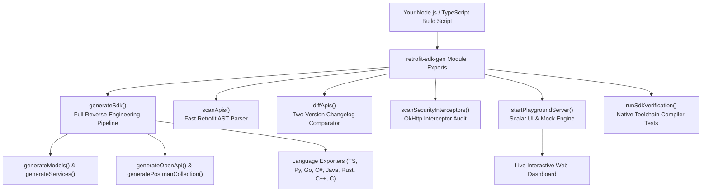

# 💻 Programmatic Node.js & TypeScript API Reference

`retrofit-sdk-gen` can be imported directly into any Node.js, Next.js, or backend build pipeline as a pure TypeScript / JavaScript library.

```typescript
import {
  generateSdk,
  startPlaygroundServer,
  scanApis,
  diffApis,
  scanSecurityInterceptors,
  clearSourcesCache,
  clearDownloadedJadx,
  clearAll,
  generateOpenApi,
  generatePostmanCollection,
  generatePythonSdk,
  generateGoSdk,
  generateCSharpSdk,
  generateJavaSdk,
  generateRustSdk,
  generateCppSdk,
  generateCSdk,
  detectToolchains,
  compileSdk,
  runSdkVerification,
} from "retrofit-sdk-gen";
```

---

## 🏛️ Programmatic Architecture



---

## Table of Contents
1. [`generateSdk()`](#1-generatesdkoptions)
2. [`startPlaygroundServer()`](#2-startplaygroundserveroptions)
3. [`diffApis()`](#3-diffapistargeta-targetb)
4. [`scanSecurityInterceptors()`](#4-scansecurityinterceptorsoptions)
5. [`scanApis()`](#5-scanapisoptions)
6. [`generateOpenApi()`](#6-generateopenapiendpoints-options)
7. [`generatePostmanCollection()`](#7-generatepostmancollectionendpoints-options)
8. [Individual Language Exporters](#8-individual-language-exporters)
9. [Cache & JADX Maintenance Functions](#9-cache--jadx-maintenance-functions)
10. [`runSdkVerification()` & Toolchain Probes](#10-runsdkverification--toolchain-probes)

---

## 1. `generateSdk(options)`

Runs Stages 1–3 of the SDK generation pipeline. Automatically decompiles APK packages if needed, scans endpoints, extracts DTO models, and scaffolds client code.

```typescript
import { generateSdk, SdkGeneratorOptions, SdkGeneratorResult } from "retrofit-sdk-gen";

const result: SdkGeneratorResult = await generateSdk({
  sourcesDir: "./app.apk",
  outputDir: "./dist-sdk",
  languages: ["typescript", "python", "go", "csharp", "java", "rust", "cpp", "c"],
  openapiPath: "./dist-sdk/openapi.json",
  postmanPath: "./dist-sdk/postman_collection.json",
  scanSecurity: true,
  sourcesOut: "./decompiled-sources",
  verbose: true,
});

console.log(`Generated ${result.scanResult.totalCount} endpoints in ${result.durationMs}ms`);
```

### Options (`SdkGeneratorOptions`):
| Property | Type | Description |
| :--- | :--- | :--- |
| `sourcesDir` | `string` | Path to `.apk`, `.apkm`, `.xapk`, `.aab`, or `sources/` folder. |
| `outputDir` | `string` | Target folder for generated SDK (Default: `sdk`). |
| `languages` | `SupportedLanguage[]` | Array of languages: `"typescript"`, `"python"`, `"go"`, `"csharp"`, `"java"`, `"rust"`, `"cpp"`, `"c"`. |
| `sourcesOut` | `string` | Optional path to export decompiled Java/Kotlin sources. |
| `openapiPath` | `string` | Path to export OpenAPI 3.0 specification. |
| `postmanPath` | `string` | Path to export Postman Collection v2.1. |
| `scanSecurity` | `boolean` | Set `true` to audit OkHttp Interceptors. |
| `jadxPath` | `string` | Custom path to local JADX binary. |
| `noCache` | `boolean` | Bypass decompilation cache. |
| `cleanCache` | `boolean` | Wipes decompiled sources cache before generating. |
| `cleanJadx` | `boolean` | Removes downloaded JADX binary before generating (forces fresh download). |
| `verbose` | `boolean` | Enable verbose indexing output. |

### Result (`SdkGeneratorResult`):
```typescript
interface SdkGeneratorResult {
  scanResult: ScanResult;
  modelsResult: GenerateModelsResult;
  servicesResult: GenerateServicesResult;
  clientCreated: boolean;
  outputDir: string;
  durationMs: number;
  openapiPath?: string;
  postmanPath?: string;
  securityResult?: SecurityScanResult;
  pythonDir?: string;
  goDir?: string;
  csharpDir?: string;
  javaDir?: string;
  rustDir?: string;
  cppDir?: string;
  cDir?: string;
}
```

---

## 2. `startPlaygroundServer(options)`

Launches a lightweight, zero-dependency Node.js HTTP server hosting the **Scalar API Reference** UI and synthetic mock response engine.

```typescript
import { startPlaygroundServer, scanApis, generateOpenApi } from "retrofit-sdk-gen";

const scanResult = scanApis({ sourcesDir: "./sources" });
const openapiSpec = generateOpenApi(scanResult.apis, {
  baseUrl: scanResult.detectedBaseUrl,
});

const server = await startPlaygroundServer({
  port: 4000,
  apis: scanResult.apis,
  openapiSpec: openapiSpec,
  baseUrl: scanResult.detectedBaseUrl,
  verbose: true,
});

console.log(`Scalar UI accessible at: ${server.url}`);
// Close server when done:
// server.server.close();
```

---

## 3. `diffApis(targetA, targetB)`

Compares two Android packages or source folders directly and generates a structured API diff object and markdown report.

```typescript
import { diffApis, formatDiffMarkdown } from "retrofit-sdk-gen";

const diffResult = await diffApis("./app-v1.0.apk", "./app-v1.1.apk");

console.log("Added endpoints:", diffResult.added.length);
console.log("Removed endpoints:", diffResult.removed.length);
console.log("Modified endpoints:", diffResult.modified.length);

const markdownReport = formatDiffMarkdown(diffResult);
console.log(markdownReport);
```

---

## 4. `scanSecurityInterceptors(options)`

Scans decompiled sources for classes implementing `okhttp3.Interceptor` to identify global tracking headers, session cookies, and authentication mechanisms.

```typescript
import { scanSecurityInterceptors } from "retrofit-sdk-gen";

const result = scanSecurityInterceptors({ sourcesDir: "./sources" });

console.log("Discovered OkHttp Interceptors:", result.interceptorsFound);
console.log("Detected Header Names:", result.detectedHeaderNames);
console.log("Identified Auth Headers:", result.authHeaders);
```

---

## 5. `scanApis(options)`

Scans Java/Kotlin interfaces for Retrofit annotations (`@GET`, `@POST`, `@Query`, `@Path`, `@Header`, etc.) and resolves unquoted constants.

```typescript
import { scanApis } from "retrofit-sdk-gen";

const result = scanApis({
  sourcesDir: "./sources",
  verbose: false,
});

console.log(`Found ${result.totalCount} endpoints across ${result.modulesCount} modules`);
console.log(`Detected Base URL: ${result.detectedBaseUrl}`);
```

---

## 6. `generateOpenApi(endpoints, options)`

Converts scanned Retrofit endpoints into a fully compliant OpenAPI 3.0.3 specification JSON object.

```typescript
import { generateOpenApi } from "retrofit-sdk-gen";

const spec = generateOpenApi(endpoints, {
  title: "My Mobile API",
  version: "1.0.0",
  baseUrl: "https://api.example.com",
  outputFile: "./openapi.json", // Optional: saves to disk
});
```

---

## 7. `generatePostmanCollection(endpoints, options)`

Generates a Postman Collection v2.1 organized into folders by Retrofit Service.

```typescript
import { generatePostmanCollection } from "retrofit-sdk-gen";

const collection = generatePostmanCollection(endpoints, {
  title: "My App API Collection",
  baseUrl: "https://api.example.com",
  outputFile: "./postman_collection.json", // Optional
});
```

---

## 8. Individual Language Exporters

You can generate any specific language SDK programmatically:

```typescript
import {
  generatePythonSdk,
  generateGoSdk,
  generateCSharpSdk,
  generateJavaSdk,
  generateRustSdk,
  generateCppSdk,
  generateCSdk,
} from "retrofit-sdk-gen";

// Python
generatePythonSdk({ endpoints, outputDir: "./sdk/python", baseUrl: "https://api.example.com" });

// Go
generateGoSdk({ endpoints, outputDir: "./sdk/go", baseUrl: "https://api.example.com" });

// C# (.NET 8)
generateCSharpSdk({ endpoints, outputDir: "./sdk/csharp", namespace: "MyApp.Sdk" });

// Java (11+)
generateJavaSdk({ endpoints, outputDir: "./sdk/java", packageName: "com.myapp.sdk" });

// Rust
generateRustSdk({ endpoints, outputDir: "./sdk/rust", crateName: "myapp_sdk" });

// C++17 Header-Only
generateCppSdk({ endpoints, outputDir: "./sdk/cpp", namespaceName: "myapp" });

// ANSI C99
generateCSdk({ endpoints, outputDir: "./sdk/c", prefix: "myapp" });
```

---

## 9. Cache & JADX Maintenance Functions

Programmatic functions to inspect and clear the decompiled sources cache or remove the auto-downloaded JADX toolchain directly from Node.js scripts.

```typescript
import {
  clearSourcesCache,
  clearDownloadedJadx,
  clearAll,
  CleanResult,
} from "retrofit-sdk-gen";

// 1. Clear decompiled APK cache:
const cacheResult: CleanResult = clearSourcesCache();
console.log(`Cleared ${cacheResult.formattedSize} from ${cacheResult.path}`);

// 2. Remove downloaded JADX binary:
const jadxResult: CleanResult = clearDownloadedJadx();
console.log(`Removed ${jadxResult.formattedSize} from ${jadxResult.path}`);

// 3. Clear both in one step:
const { cache, jadx } = clearAll();
```

### Type Definition (`CleanResult`):
```typescript
interface CleanResult {
  cleared: boolean;
  path: string;
  freedBytes: number;
  formattedSize: string;
}
```

---

## 10. `runSdkVerification()` & Toolchain Probes

Runs the automated 4-stage verification suite programmatically:

```typescript
import { runSdkVerification, detectToolchains } from "retrofit-sdk-gen";

// 1. Probe local compilers:
const toolchains = detectToolchains();
console.log(toolchains.go.installed, toolchains.csharp.installed);

// 2. Run complete test runner against an APK:
const testResult = await runSdkVerification({
  inputTarget: "./app.apk",
  languages: ["typescript", "python", "go", "csharp", "java", "rust", "cpp", "c"],
  strict: false,
  skipMock: false,
  keepOutput: false,
});

console.log(`Passed: ${testResult.passed} (${testResult.totalDurationMs}ms)`);
```

