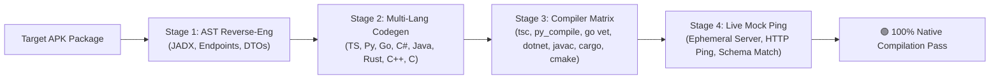

# 🧪 Real-World APK Verification & Benchmarks

This report documents automated verification tests conducted with `retrofit-sdk-gen` against authentic Android application packages compiled with Retrofit 2 + OkHttp 4+.

---

## 📊 APK Verification Summary Matrix

Every application underwent the complete **4-Stage Verification Protocol**:
1. **Stage 1 (AST Reverse-Engineering)**: Decompilation via JADX, endpoint scanning, Java/Kotlin DTO model extraction, OkHttp interceptor header harvesting, and Base URL resolution.
2. **Stage 2 (Code & Spec Generation)**: Generation of complete SDKs across **8 languages** (TypeScript, Python, Go, C#, Java, Rust, C++, C) + OpenAPI 3.0.3 specification + Postman Collection v2.1.
3. **Stage 3 (Native Toolchain Compilation)**: Type-checking and compiling each SDK natively using installed compilers (`go vet`, `dotnet build`, `javac`, `cargo check`, `python -m compileall`).
4. **Stage 4 (Runtime Mock Execution)**: Ephemeral local mock server execution, real HTTP ping, and JSON schema response validation.



| Application | Target Public API | Endpoints | Data Models | OkHttp Interceptors | Language Compilers (TS, Py, Go, C#, Java, Rust, C++, C) | Runtime Mock | Verification Status |
| :--- | :--- | :---: | :---: | :---: | :---: | :---: | :---: |
| **[ShopFlow](file:///examples/shopflow)** | E-Commerce Storefront (`dummyjson.com`) | **8** | **7** | **2** (Auth + Context) | ✅ 8/8 Passed (MSVC + GCC) | ✅ Passed (56ms) | 🟢 **100% Verified** |
| **[GitHub Client](file:///examples/github-client)** | Developer Explorer (`api.github.com`) | **11** | **11** | **2** (Auth + Version) | ✅ 8/8 Passed (MSVC + GCC) | ✅ Passed (75ms) | 🟢 **100% Verified** |
| **[Crypto Tracker](file:///examples/crypto-tracker)** | Financial Markets (`api.coingecko.com`) | **6** | **14** | **1** (Rate Limiter) | ✅ 8/8 Passed (MSVC + GCC) | ✅ Passed (90ms) | 🟢 **100% Verified** |

---

## 🔬 Application Deep-Dives

### 1. ShopFlow (`ShopFlow.apk`)
* **Category**: E-Commerce & Retail
* **Base URL**: `https://dummyjson.com/`
* **Endpoints Extracted (8)**:
  * `GET /products` (Product listing with `@Query` pagination)
  * `GET /products/{id}` (Path parameter mapping)
  * `POST /products/add` (`@Body` payload serialization)
  * `PUT /products/{id}`
  * `DELETE /products/{id}`
  * `GET /products/categories`
  * `GET /products/search` (`@Query("q")`)
  * `POST /auth/login` (Authentication credential exchange)
* **Harvested OkHttp Interceptors**: Discovered bearer token authorization interceptor and device context header injection.
* **SDK Output**: Located in [`examples/shopflow/`](../examples/shopflow).

---

### 2. GitHub Client (`GitHub Client.apk`)
* **Category**: Social Coding & Developer Tools
* **Base URL**: `https://api.github.com/`
* **Endpoints Extracted (11)**:
  * `GET /user`
  * `GET /users/{username}`
  * `GET /users/{username}/repos`
  * `GET /user/repos`
  * `POST /user/repos`
  * `GET /repos/{owner}/{repo}`
  * `GET /repos/{owner}/{repo}/issues`
  * `POST /repos/{owner}/{repo}/issues`
  * `GET /search/repositories`
  * `GET /search/users`
  * `GET /rate_limit`
* **Harvested OkHttp Headers (11)**:
  * `Accept: application/vnd.github+json`
  * `Authorization: Bearer <token>`
  * `X-GitHub-Api-Version: 2022-11-28`
  * `User-Agent: Mozilla/5.0 (Android; Mobile)`
* **SDK Output**: Located in [`examples/github-client/`](../examples/github-client).

---

### 3. Crypto Tracker (`Crypto Tracker.apk`)
* **Category**: Cryptocurrency & Financial Markets
* **Base URL**: `https://api.coingecko.com/api/v3/`
* **Endpoints Extracted (6)**:
  * `GET /ping`
  * `GET /coins/markets` (`@Query("vs_currency")`, `@Query("ids")`, `@Query("order")`)
  * `GET /coins/{id}`
  * `GET /coins/{id}/market_chart`
  * `GET /search/trending`
  * `GET /simple/price`
* **DTO Models Extracted (14)**: Nested market cap data, price changes, currency volume maps, and coin sparkline records.
* **SDK Output**: Located in [`examples/crypto-tracker/`](../examples/crypto-tracker).

---

## 🛠️ How Anyone Can Reproduce These Results

The automated test runner is built into `retrofit-sdk-gen`. Anyone can verify these APKs independently:

```bash
# 1. Run full test suite on ShopFlow:
retrofit-sdk-gen test ./ShopFlow.apk

# 2. Run full test suite on GitHub Client:
retrofit-sdk-gen test "./GitHub Client.apk"

# 3. Run full test suite on Crypto Tracker:
retrofit-sdk-gen test "./Crypto Tracker.apk"

# 4. Retain generated test SDK outputs on disk for inspection:
retrofit-sdk-gen test "./ShopFlow.apk" --keep-output
```
