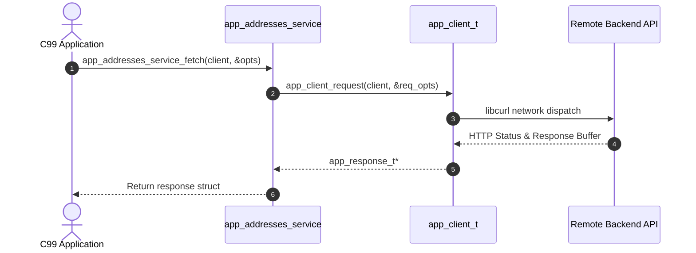

# 🔤 ANSI C99 SDK Guide

The generated C SDK provides a pure ANSI C99 interface with procedural functions, static headers, and explicit memory allocation/free lifecycle management.

---

## 📁 Directory Structure

```
sdk/c/
├── Makefile                # Standard build script producing static library libapp_sdk.a
├── include/
│   ├── client.h           # app_client_t struct and core HTTP declarations
│   ├── models.h           # 386+ ANSI C99 data structs
│   └── services.h         # 329 service function prototypes
└── src/
    ├── client.c           # Client implementation
    └── services.c         # Endpoint dispatchers
```

---

## 🚀 Getting Started

### 1. Generating the SDK

```bash
npx retrofit-sdk-gen ./app.apk --lang c --output ./my-c-sdk
```

### 2. Building the Static Library

```bash
cd my-c-sdk
make
# Produces libapp_sdk.a
```

---

## 💡 Making API Calls



```c
#include "client.h"
#include "services.h"
#include <stdio.h>

int main(void) {
    // 1. Initialize client
    app_client_t* client = app_client_new("https://api.example.com");
    if (!client) {
        fprintf(stderr, "Failed to allocate client\n");
        return 1;
    }

    // 2. Set authentication token
    app_client_set_auth(client, "your_access_token_here");

    // 3. Set custom telemetry header
    app_client_add_header(client, "X-Client-Version", "1.0.0");

    // 4. Dispatch service call
    app_request_opts_t opts = {0};
    app_response_t* resp = app_addresses_service_fetch_addresses_with_rx(client, &opts);

    if (resp && resp->ok) {
        printf("HTTP %ld: %s\n", resp->status_code, resp->body);
    } else {
        fprintf(stderr, "Request failed\n");
    }

    // 5. Clean up memory
    app_response_free(resp);
    app_client_free(client);

    return 0;
}
```
