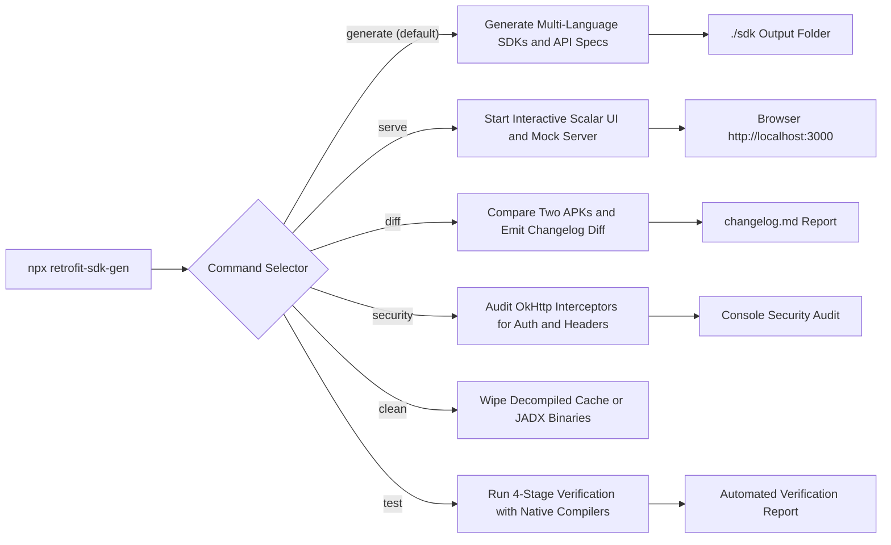

# 🛠️ CLI Complete Reference Guide

This guide documents every command, flag, argument, and configuration option available in `retrofit-sdk-gen`.

---

## Table of Contents
1. [Installation & Execution](#installation--execution)
2. [Input Formats & Automatic Detection](#input-formats--automatic-detection)
3. [Commands Overview](#commands-overview)
4. [`generate` (Default Command)](#1-generate-default-command)
5. [`serve` (API Playground & Mock Server)](#2-serve-api-playground--mock-server)
6. [`diff` (APK-to-APK API Changelog)](#3-diff-apk-to-apk-api-changelog)
7. [`security` (OkHttp Interceptor Audit)](#4-security-okhttp-interceptor-audit)
8. [`clean` (Maintenance & Cache Reset)](#5-clean-maintenance--cache-reset)
9. [`test` (Automated SDK Verification & Compiler Matrix)](#6-test-automated-sdk-verification--compiler-matrix)
10. [Decompilation Caching & JADX Management](#decompilation-caching--jadx-management)
11. [Exit Codes & Error Handling](#exit-codes--error-handling)

---

## Installation & Execution

You can run `retrofit-sdk-gen` directly with `npx` without installing it globally:

```bash
npx retrofit-sdk-gen [input] [options]
```

Or install it globally / locally:
```bash
npm install -g retrofit-sdk-gen
retrofit-sdk-gen [input] [options]
```

---

## Input Formats & Automatic Detection

`retrofit-sdk-gen` accepts both **raw Android packages** and **decompiled directories**:

| Format | Extension / Pattern | Behavior |
| :--- | :--- | :--- |
| **Standard APK** | `.apk` | Automatically decompiled via JADX with code-only optimization (`--no-res`). |
| **Split APK Bundle** | `.apkm`, `.xapk`, `.apks` | Unpacks archive, extracts `base.apk`, and decompiles it. |
| **Android App Bundle** | `.aab` | Decompiles bytecode into source classes. |
| **ZIP Archive** | `.zip` | Searches for APK or decompiled source structure. |
| **Source Directory** | Folder (e.g. `./sources`) | Skips decompilation and scans Java/Kotlin source trees directly. |

---

## Commands Overview

| Command | Syntax | Purpose |
| :--- | :--- | :--- |
| `generate` | `npx retrofit-sdk-gen [input]` | **Default**. Scans endpoints, models, and generates multi-language SDKs. |
| `serve` | `npx retrofit-sdk-gen serve [input]` | Boots a local Scalar UI API documentation explorer & mock server. |
| `diff` | `npx retrofit-sdk-gen diff <A> <B>` | Compares two APKs or source trees and generates an API Changelog. |
| `security` | `npx retrofit-sdk-gen security [input]` | Audits OkHttp Interceptors to discover global headers and auth schemes. |
| `clean` | `npx retrofit-sdk-gen clean [--cache] [--jadx] [--all]` | Cleans cached decompiled sources and/or downloaded JADX toolchain. |
| `test` | `npx retrofit-sdk-gen test <input> [options]` | Runs 4-stage automated verification (AST, generation, native compile, mock test). |

### 🧭 CLI Dispatch Flow



---

## 1. `generate` (Default Command)

Generates strongly-typed SDKs, OpenAPI 3.0 specs, and Postman collections from Retrofit definitions.

```bash
npx retrofit-sdk-gen [input] [options]
```

### Options & Flags

#### `-s, --sources <path>`
- **Type**: `string`
- **Default**: Auto-detected from `[input]` or `./sources`
- **Description**: Explicit path to an Android package (`.apk`, `.apkm`, `.xapk`, `.aab`) or extracted `sources/` directory.

#### `-o, --output <path>`
- **Type**: `string`
- **Default**: `./sdk`
- **Description**: Target directory where generated SDK files will be saved.

#### `-l, --lang <languages>`
- **Type**: `string` (comma-separated or single)
- **Default**: `typescript`
- **Supported Values**:
  - `typescript` (or `ts`)
  - `python`
  - `go`
  - `csharp` (or `c#`)
  - `java`
  - `rust`
  - `cpp` (or `c++`)
  - `c`
  - `all` (Generates all 8 languages simultaneously)
- **Examples**:
  ```bash
  # Single language:
  --lang python

  # Multiple languages:
  --lang python,go,csharp

  # All 8 languages:
  --lang all
  ```

#### `--sources-out <path>` (Alias: `--export-sources <path>`)
- **Type**: `string`
- **Default**: `None`
- **Description**: Copies all reconstructed Java/Kotlin source files (`.java`, `.kt`) to a permanent folder for reverse-engineering inspection in your IDE.
- **Example**:
  ```bash
  npx retrofit-sdk-gen ./app.apk --sources-out ./decompiled_sources
  ```

#### `--openapi [path]`
- **Type**: `string` (Optional path)
- **Default**: `<output>/openapi.json`
- **Description**: Generates an OpenAPI 3.0.3 specification with JSON Schema models mapped from Retrofit DTOs.
- **Example**:
  ```bash
  npx retrofit-sdk-gen ./app.apk --openapi ./docs/spec.json
  ```

#### `--postman [path]`
- **Type**: `string` (Optional path)
- **Default**: `<output>/postman_collection.json`
- **Description**: Generates a Postman Collection v2.1 organized into folders by Service.
- **Example**:
  ```bash
  npx retrofit-sdk-gen ./app.apk --postman ./postman.json
  ```

#### `--security`
- **Type**: `boolean`
- **Default**: `false`
- **Description**: Runs an OkHttp Interceptor security audit during build and prints discovered tracking headers and auth tokens.

#### `--jadx-path <path>`
- **Type**: `string`
- **Default**: Auto-detected from system `PATH` or `~/.retrofit-sdk-gen/jadx/bin/jadx`
- **Description**: Custom path to a local JADX binary executable.

#### `--no-cache`
- **Type**: `boolean`
- **Default**: `false`
- **Description**: Bypasses the decompilation cache and forces a fresh JADX decompilation run.

#### `--clean-cache` (Alias: `--clear-cache`)
- **Type**: `boolean`
- **Default**: `false`
- **Description**: Removes cached decompiled APK sources from disk (`%TEMP%\retrofit-cache` or `/tmp/retrofit-cache`) before generating.

#### `--clean-jadx` (Alias: `--clear-jadx`)
- **Type**: `boolean`
- **Default**: `false`
- **Description**: Removes the auto-downloaded JADX binary from `~/.retrofit-sdk-gen/jadx/` before generating (forces a fresh download).

#### `--clean-all` (Alias: `--clear-all`)
- **Type**: `boolean`
- **Default**: `false`
- **Description**: Removes both cached decompiled sources and the auto-downloaded JADX toolchain before generating.

#### `-q, --quiet`
- **Type**: `boolean`
- **Default**: `false`
- **Description**: Suppresses verbose logs and AST indexing progress.

#### `-h, --help`
- **Type**: `boolean`
- **Description**: Displays the CLI help menu.

### 💡 Reviewing & Customizing Generated Client Files

Because Android applications frequently configure their base URLs (e.g. dev/staging/prod flavors, dynamic regional routing) and authentication credentials at runtime via OkHttp interceptors or dependency injection, the initial generated `Client` file serves as a functional baseline.

* **Base URLs**: If the decompiled code references relative paths or placeholder URLs (e.g. `https://api.example.com`), verify and update the `baseUrl` in your client file (`client.ts`, `client.py`, `client.go`, `Client.cs`, `Client.java`, etc.).
* **Authentication Tokens**: If the API requires custom API keys, bearer tokens, or HMAC request signing, configure them using the client's `setAuth()` method or default headers map.
* **Non-Destructive Scaffolding**: `retrofit-sdk-gen` preserves your customizations. When re-running the generator against newer APK releases, existing client files are **never overwritten**, ensuring your custom connection logic remains intact while services and data models are updated.

---

## 2. `serve` (API Playground & Mock Server)

Boots a zero-dependency local web server hosting the **Scalar API Reference** UI and an automated **Mock API Engine**.

```bash
npx retrofit-sdk-gen serve [input] [options]
```

### Options:
- `[input]`: Path to `.apk`, `.apkm`, `.xapk`, or `sources/` folder (Default: `sources`).
- `-p, --port <number>`: Port to run local server (Default: `3000`).
- `--sources-out <path>`: Optionally export sources while serving.

### Endpoints Exposed:
- `GET /`: Interactive Scalar API Reference UI with dark mode and search.
- `GET /openapi.json`: OpenAPI 3.0.3 specification JSON.
- `ALL /mock/*`: Mock API Engine returning synthetic JSON payloads matching Retrofit DTO schemas.

### Example:
```bash
npx retrofit-sdk-gen serve ./app.apk --port 8080
```

---

## 3. `diff` (APK-to-APK API Changelog)

Compares two APK releases or source directories to track API modifications, newly added endpoints, removed endpoints, and altered parameters.

```bash
npx retrofit-sdk-gen diff <targetA> <targetB> [options]
```

### Arguments:
- `<targetA>`: Base APK or sources directory (e.g. `v29.1.apk`).
- `<targetB>`: New APK or sources directory (e.g. `v29.2.apk`).

### Options:
- `-o, --output <path>`: Write the markdown changelog report to a file instead of stdout.

### Example:
```bash
npx retrofit-sdk-gen diff ./app-v1.apk ./app-v2.apk -o ./CHANGELOG.md
```

---

## 4. `security` (OkHttp Interceptor Audit)

Scans Java/Kotlin bytecode for classes implementing `okhttp3.Interceptor`. Discovers global headers, authentication schemes, and tracking metadata injected into requests.

```bash
npx retrofit-sdk-gen security [input]
```

### Example:
```bash
npx retrofit-sdk-gen security ./app.apk
```

### Output:
```
Found 3 OkHttp Interceptors:
- AuthInterceptor (com/example/network/AuthInterceptor.java) -> Adds: [Authorization, X-User-Context]
- DeviceContextInterceptor (com/example/analytics/DeviceContextInterceptor.java) -> Adds: [User-Agent, X-Tenant-Context]

All Detected Headers (12): [
  'Accept-Encoding', 'Connection', 'Content-Type', 'Cookie', 'Host',
  'X-User-Context', 'X-Tenant-Context', 'User-Agent'
]
Auth Headers: ['Authorization', 'X-User-Context']
```

---

## 5. `clean` (Maintenance & Cache Reset)

Cleans disk space by removing decompiled APK sources and/or the auto-downloaded JADX toolchain.

```bash
npx retrofit-sdk-gen clean [options]
```

### Options & Flags:

| Flag | Description | Default |
| :--- | :--- | :--- |
| `--cache` | Clears only the decompiled APK sources cache (`%TEMP%\retrofit-cache` or `/tmp/retrofit-cache`). | `false` |
| `--jadx` | Removes the auto-downloaded JADX binary (`~/.retrofit-sdk-gen/jadx/`). | `false` |
| `--all` | Cleans both the decompiled sources cache and downloaded JADX tools. | `true` (default if no flag specified) |

### Console Output Example:
The command calculates and prints the exact disk space freed:
```
================================================================================
                       RETROFIT CLEANUP UTILITY                                 
================================================================================

[CLEAN] Cleared decompiled sources cache (111.51 MB) at:
        C:\Users\<user>\AppData\Local\Temp\retrofit-cache

[CLEAN] Removed downloaded JADX binary (109.34 MB) at:
        C:\Users\<user>\.retrofit-sdk-gen\jadx

Cleanup complete!
```

### Examples:
```bash
# 1. Clean cached decompiled APK sources:
npx retrofit-sdk-gen clean --cache
# Or flag: npx retrofit-sdk-gen --clean-cache

# 2. Remove downloaded JADX binary:
npx retrofit-sdk-gen clean --jadx
# Or flag: npx retrofit-sdk-gen --clean-jadx

# 3. Clean both cache and tools:
npx retrofit-sdk-gen clean --all
# Or simply:
npx retrofit-sdk-gen clean
```

---

## 6. `test` (Automated SDK Verification & Compiler Matrix)

Runs a 4-tier automated test suite against any APK package or source tree:
1. **Stage 1 (AST Extraction)**: Asserts discovery of endpoints, DTO schemas, and OkHttp interceptors.
2. **Stage 2 (Generation)**: Emits SDKs across requested languages + OpenAPI 3.0.3 + Postman collection.
3. **Stage 3 (Native Toolchain Compilation)**: Probes local machine for compilers (`tsc`, `python`, `go`, `dotnet`, `javac`, `cargo`, `cmake`, `gcc`), automatically runs compilation checks for installed languages, and gracefully skips missing tools.
4. **Stage 4 (Runtime Mock Execution)**: Boots an ephemeral local mock server, executes real HTTP requests, and validates JSON serialization and schema alignment.

```bash
npx retrofit-sdk-gen test <input> [options]
```

### Options:

| Flag | Description | Default |
| :--- | :--- | :--- |
| `-l, --lang <list>` | Specific languages to test (e.g. `ts,python,go,csharp`). | All 8 languages |
| `--strict` | Fails the test suite if any language compiler is missing from PATH. | `false` |
| `--skip-mock` | Skips Stage 4 (runtime HTTP mock server verification). | `false` |
| `--keep-output` | Retains generated test SDK folders on disk for manual inspection. | `false` (Auto-cleaned) |

### Console Output Example:
```
================================================================================
            🧪 RETROFIT AUTOMATED SDK VERIFICATION & TEST RUNNER               
================================================================================

Target Input:   ./Store.apk
Languages:      typescript, python, go, csharp, java, rust, cpp, c
Strict Mode:    Disabled

[STAGE 1/4] Scanning and extracting AST from input...
  ✅ Stage 1 Passed: 329 endpoints, 369 models in 16078ms

[STAGE 2/4] Generating SDKs for 8 languages & specs...
  ✅ Stage 2 Passed: 8 SDKs generated in 6879ms

[STAGE 3/4] Checking local compilers and building SDKs...
  ┌────────────────────────────────────────────────────────────────────────┐
  │                       LOCAL COMPILER TOOLCHAINS                        │
  ├──────────────┬───────────┬────────────────────────────┬────────────────┤
  │ Language     │ Status    │ Binary / Version           │ Action         │
  ├──────────────┼───────────┼────────────────────────────┼────────────────┤
  │ typescript   │ ✅ Ready  │ Version 5.9.3              │ Compile & Vet  │
  │ python       │ ✅ Ready  │ Python 3.14.7              │ Compile & Vet  │
  │ go           │ ✅ Ready  │ go version go1.27.0 window │ Compile & Vet  │
  │ csharp       │ ✅ Ready  │ .NET 10.0.400              │ Compile & Vet  │
  │ java         │ ✅ Ready  │ javac 26.0.2.1             │ Compile & Vet  │
  │ rust         │ ✅ Ready  │ cargo 1.98.0               │ Compile & Vet  │
  │ cpp          │ ⚠️  Missing│ clang++                    │ Skip (No Tool) │
  │ c            │ ⚠️  Missing│ clang                      │ Skip (No Tool) │
  └──────────────┴───────────┴────────────────────────────┴────────────────┘

  Building [typescript]... ✅ PASSED (1200ms)
  Building [python]...     ✅ PASSED (700ms)
  Building [go]...         ✅ PASSED (1536ms)
  Building [csharp]...     ✅ PASSED (13258ms)
  Building [java]...       ✅ PASSED (10685ms)
  Building [rust]...       ✅ PASSED (114034ms)
  Building [cpp]...        ⏩ SKIPPED (Toolchain not found)
  Building [c]...          ⏩ SKIPPED (Toolchain not found)

[STAGE 4/4] Verifying End-to-End Mock Server & Request Serialization...
  ✅ Stage 4 Passed: Runtime mock server verified in 241ms

================================================================================
                      🎉 VERIFICATION SUITE PASSED!                             
================================================================================
```

### Examples:
```bash
# 1. Run full automated verification on an APK:
npx retrofit-sdk-gen test ./Store.apk

# 2. Test specific languages only:
npx retrofit-sdk-gen test ./Store.apk --lang ts,python,go

# 3. CI/CD strict verification (fails if any compiler is missing):
npx retrofit-sdk-gen test ./Store.apk --strict
```

---

## Decompilation Caching & JADX Management

### 1. JADX Auto-Download
If `jadx` is not found on your system `PATH`:
- Automatically downloads official JADX v1.5.0 zip (~30MB) from GitHub.
- Extracts it into `~/.retrofit-sdk-gen/jadx/`.
- No Java installation or manual setup required.

### 2. Cache Directory
Decompiled files are cached by package hash:
- **Windows**: `C:\Users\<user>\AppData\Local\Temp\retrofit-cache\<hash>\sources`
- **Linux / macOS**: `/tmp/retrofit-cache/<hash>/sources`

Hashes are calculated from file size, modification timestamp, and SHA-256 header. Subsequent runs on the same package execute in **0 milliseconds**.

To bypass the cache on a single run, pass `--no-cache`.

### 3. Cache & Toolchain Maintenance
You can safely reclaim disk space or reset the toolchain at any time:
- Run `npx retrofit-sdk-gen clean --cache` to wipe all decompiled packages.
- Run `npx retrofit-sdk-gen clean --jadx` to remove the downloaded JADX distribution.
- Run `npx retrofit-sdk-gen clean --all` to reset both.
