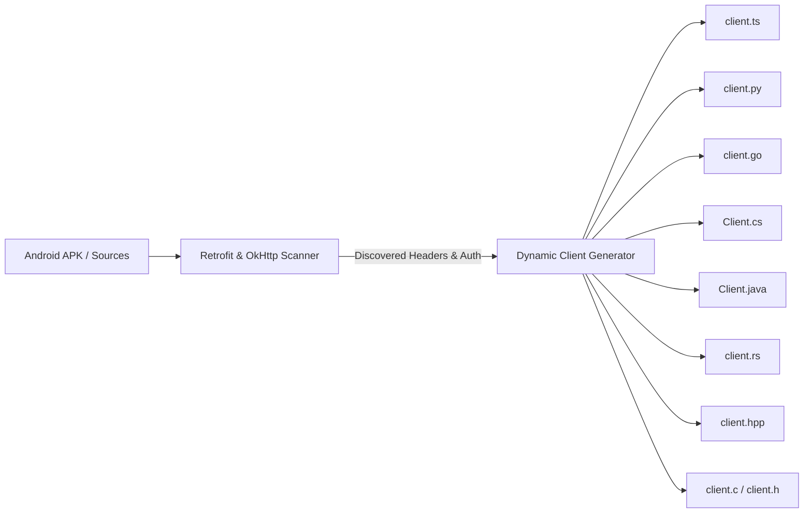

# 🌐 Universal Client Configuration Guide

Every SDK generated by `retrofit-sdk-gen` includes an idiomatic, lightweight HTTP client scaffolded in your target language. The client acts as the central transport engine responsible for managing **base URLs**, **authentication headers**, **OkHttp-discovered mobile metadata**, and **request lifecycle hooks**.

---

## 📑 Table of Contents

1. [Core Client Architecture](#-core-client-architecture)
2. [The Non-Destructive Scaffolding Rule](#-the-non-destructive-scaffolding-rule)
3. [Language-by-Language Configuration](#-language-by-language-configuration)
   - [1. TypeScript (`client.ts`)](#1-typescript-clientts)
   - [2. Python (`client.py`)](#2-python-clientpy)
   - [3. Go (`client.go`)](#3-go-clientgo)
   - [4. C# (.NET 8+) (`Client.cs`)](#4-c-net-8-clientcs)
   - [5. Java 11+ (`Client.java`)](#5-java-11-clientjava)
   - [6. Rust (`client.rs`)](#6-rust-clientrs)
   - [7. Modern C++17 (`client.hpp`)](#7-modern-c17-clienthpp)
   - [8. ANSI C99 (`client.h` & `client.c`)](#8-ansi-c99-clienth--clientc)
4. [Advanced Recipes & Customizations](#-advanced-recipes--customizations)
   - [Dynamic Request Signing & HMAC](#dynamic-request-signing--hmac)
   - [Automatic Token Refresh (401 Retry Loop)](#automatic-token-refresh-401-retry-loop)
   - [HTTP & HTTPS Proxies (Fiddler, Charles, Burp Suite)](#http--https-proxies-fiddler-charles-burp-suite)
5. [Client Feature Matrix](#-client-feature-matrix)

---

## 🏛️ Core Client Architecture

During reverse engineering, `retrofit-sdk-gen` extracts base URLs and audits OkHttp Interceptors (`okhttp3.Interceptor`). It uses this metadata to pre-populate the client scaffold:



### Key Shared Capabilities:
- **Base URL Resolution**: Defaults to the detected APK base URL or fallback (`https://api.example.com`). Automatically cleans trailing slashes.
- **Smart Auth Helpers**: Automatically detects whether authentication uses `Authorization`, `Auth-Token`, `X-Auth-Token`, or custom headers, and automatically ensures tokens are prefixed with `Bearer ` if required.
- **Discovered Tracking Headers**: Pre-populates mobile headers discovered from APK OkHttp interceptors (such as `User-Agent`, `App-Version`, `Instance-Id`, etc.).
- **Dual Pattern**: Supports both a convenient **Global Singleton Client** for quick scripts and **Isolated Client Instances** for multi-tenant applications.

---

## 🔒 The Non-Destructive Scaffolding Rule

> [!IMPORTANT]
> **Client files are NEVER overwritten on subsequent SDK regenerations.**
>
> When you re-run `npx retrofit-sdk-gen ./app.apk` to update service endpoints or DTO models, existing client files (`client.ts`, `client.py`, `client.go`, etc.) are safely preserved. You can freely add custom retry loops, OAuth2 refresh flows, HMAC signing, proxy configurations, or telemetry logging directly into the client file without fear of losing your changes on future builds.

---

## 🌍 Language-by-Language Configuration

### 1. TypeScript (`client.ts`)

Built on Web Standards (`fetch`, `Headers`, `RequestInit`, `URL`). Zero third-party dependencies.

#### File Location:
```
sdk/typescript/client.ts
```

#### Global Configuration:
```typescript
import { defaultClient, AddressesService } from "./sdk/typescript";

// 1. Change Base URL
defaultClient.baseUrl = "https://api.staging.example.com";

// 2. Set Authentication Token (auto-prefixes 'Bearer ' if missing)
defaultClient.setAuth("eyJhbGciOiJIUzI1NiIsIn...");

// 3. Set Custom or Telemetry Headers
defaultClient.headers["X-App-Version"] = "2.4.0";
defaultClient.headers["User-Agent"] = "MyApp/2.4.0 (Mobile; Android)";

// 4. Pre-Request Interceptor Hook (for HMAC, nonces, timestamps)
defaultClient.beforeRequest = async (reqInit: RequestInit, url: URL) => {
  reqInit.headers["X-Timestamp"] = Date.now().toString();
};
```

#### Isolated Multi-Tenant Client:
```typescript
import { HttpClient } from "./sdk/typescript/client";
import { AddressesService } from "./sdk/typescript";

const tenantClient = new HttpClient("https://tenant-a.api.example.com");
tenantClient.setAuth("tenant_token_abc");

// Pass isolated client to service call
const response = await AddressesService.fetchAddresses(
  { queryParams: { context: "checkout" } },
  tenantClient
);
```

---

### 2. Python (`client.py`)

Pure standard library client using `urllib.request` and Python `dataclasses`. Compatible with Python 3.10+.

#### File Location:
```
sdk/python/client.py
```

#### Global Configuration:
```python
from sdk.python.client import default_client
from sdk.python.services import AddressesService

# 1. Change Base URL
default_client.base_url = "https://api.staging.example.com"

# 2. Set Authentication Token
default_client.set_auth("your_access_token_here")

# 3. Add Custom Headers
default_client.headers["X-Client-Id"] = "mobile-android"
default_client.headers["X-Device-Locale"] = "en_US"

# 4. Make API Call
response = AddressesService.fetch_addresses(context="checkout")
if response.ok:
    print("Data:", response.data)
else:
    print(f"Failed [{response.status}]: {response.error}")
```

#### Isolated Instance Configuration:
```python
from sdk.python.client import HttpClient
from sdk.python.services import AddressesService

custom_client = HttpClient(base_url="https://tenant-b.api.example.com")
custom_client.set_auth("token_tenant_b")

# Pass custom client to service
response = AddressesService.fetch_addresses(client=custom_client, context="cart")
```

---

### 3. Go (`client.go`)

High-performance, zero-dependency client using Go's `net/http` and `context.Context`.

#### File Location:
```
sdk/go/client.go
```

#### Configuration & Initialization:
```go
package main

import (
    "context"
    "fmt"
    "net/http"
    "time"

    sdk "my-go-sdk"
)

func main() {
    // 1. Initialize Client with Base URL
    client := sdk.NewClient("https://api.staging.example.com")

    // 2. Set Authentication Token
    client.SetAuth("your_jwt_or_api_key")

    // 3. Set Custom Request Headers
    client.Headers["X-App-Version"] = "2.4.0"
    client.Headers["X-Device-ID"] = "android-uuid-1234"

    // 4. Tune Network Timeouts or Transport
    client.HTTPClient.Timeout = 15 * time.Second

    // 5. Execute API Call with Context
    ctx, cancel := context.WithTimeout(context.Background(), 5*time.Second)
    defer cancel()

    svc := sdk.NewAddressesService(client)
    res, err := svc.FetchAddresses(ctx, map[string]interface{}{
        "context": "checkout",
    })
    if err != nil {
        panic(err)
    }
    fmt.Printf("Status: %d, Response: %s\n", res.StatusCode, string(res.Body))
}
```

---

### 4. C# (.NET 8+) (`Client.cs`)

Modern async/await client utilizing `System.Net.Http.HttpClient`, `System.Text.Json`, and cancellation tokens.

#### File Location:
```
sdk/csharp/Client.cs
```

#### Global Configuration:
```csharp
using System;
using System.Threading.Tasks;
using App.Sdk;

class Program
{
    static async Task Main()
    {
        // 1. Configure Global Default Client
        GlobalSdk.DefaultClient.BaseUrl = "https://api.staging.example.com";
        GlobalSdk.DefaultClient.SetAuth("your_bearer_token");

        // 2. Add Custom Default Headers
        GlobalSdk.DefaultClient.DefaultHeaders["X-Client-Platform"] = "Android";
        GlobalSdk.DefaultClient.DefaultHeaders["X-Client-Version"] = "29.1";

        // 3. Make API Call
        var response = await AddressesService.FetchAddressesAsync(new Dictionary<string, object>
        {
            ["context"] = "checkout"
        });

        if (response.Ok)
        {
            Console.WriteLine($"Addresses count: {response.Data?.Count}");
        }
    }
}
```

#### Dependency Injection with `IHttpClientFactory` (ASP.NET Core):
```csharp
// In Program.cs / Startup.cs:
builder.Services.AddHttpClient("MobileApi", client =>
{
    client.BaseAddress = new Uri("https://api.example.com");
    client.Timeout = TimeSpan.FromSeconds(20);
});

// Using inside your service:
public class OrderService
{
    private readonly HttpClientWrapper _client;

    public OrderService(IHttpClientFactory factory)
    {
        var httpClient = factory.CreateClient("MobileApi");
        _client = new HttpClientWrapper("https://api.example.com", httpClient);
        _client.SetAuth("my_token");
    }
}
```

---

### 5. Java 11+ (`Client.java`)

Modern, zero-dependency Java client using `java.net.http.HttpClient` with immutable request builders.

#### File Location:
```
sdk/java/src/main/java/com/app/sdk/Client.java
```

#### Configuration & Initialization:
```java
package com.example;

import com.app.sdk.Client;
import com.app.sdk.AddressesService;
import com.app.sdk.ApiResponse;
import java.util.Map;

public class Main {
    public static void main(String[] args) {
        // 1. Instantiate Client
        Client client = new Client("https://api.staging.example.com");

        // 2. Configure Authentication Token
        client.setAuth("eyJhbGciOiJIUzI1NiIsIn...");

        // 3. Execute Service Request
        AddressesService service = new AddressesService(client);
        ApiResponse<String> response = service.fetchAddresses(
            Map.of("context", "checkout", "check_pin", "true"),
            null
        );

        if (response.isSuccess()) {
            System.out.println("Response JSON: " + response.getData());
        } else {
            System.err.println("Request Failed with code: " + response.getStatusCode());
        }
    }
}
```

---

### 6. Rust (`client.rs`)

Asynchronous, high-performance client powered by `reqwest`, `tokio`, and `serde_json`.

#### File Location:
```
sdk/rust/src/client.rs
```

#### Configuration & Builder Pattern:
```rust
use app_sdk::client::Client;
use app_sdk::services::AddressesService;
use std::collections::HashMap;

#[tokio::main]
async fn main() -> Result<(), Box<dyn std::error::Error>> {
    // 1. Create client and configure token via builder pattern
    let client = Client::new(Some("https://api.staging.example.com"))
        .with_token("your_secret_bearer_token");

    // 2. Initialize Service with Client reference
    let service = AddressesService::new(&client);

    // 3. Make Request
    let mut query = HashMap::new();
    query.insert("context", "checkout");

    let response = service.fetch_addresses(Some(&query)).await?;
    println!("Status Code: {}", response.status());

    let body_text = response.text().await?;
    println!("Body: {}", body_text);

    Ok(())
}
```

---

### 7. Modern C++17 (`client.hpp`)

Header-only C++17 client interface with STL containers and default singleton provider.

#### File Location:
```
sdk/cpp/include/client.hpp
```

#### Configuration:
```cpp
#include "client.hpp"
#include <iostream>

int main() {
    // 1. Access Global Singleton Client
    auto& client = app::Client::get_default();
    client.base_url = "https://api.staging.example.com";

    // 2. Set Authentication Token
    client.set_auth("your_auth_token_here");

    // 3. Add Custom Headers
    client.default_headers["X-Client-Type"] = "Desktop-Cpp";
    client.default_headers["X-SDK-Version"] = "1.0.0";

    // 4. Make Request
    app::RequestOptions opts;
    opts.method = "GET";
    opts.endpoint = "/users/addresses";
    opts.query_params["context"] = "checkout";

    app::ApiResponse res = client.request(opts);
    std::cout << "Status: " << res.status_code << "\n";
    std::cout << "Body: " << res.body << "\n";

    return 0;
}
```

---

### 8. ANSI C99 (`client.h` & `client.c`)

Procedural, lightweight C client suitable for embedded systems, game engines, and microcontrollers.

#### File Locations:
```
sdk/c/include/client.h
sdk/c/src/client.c
```

#### Configuration & Lifecycle:
```c
#include "client.h"
#include <stdio.h>

int main(void) {
    // 1. Allocate & Initialize Client
    app_client_t* client = app_client_new("https://api.staging.example.com");
    if (!client) {
        fprintf(stderr, "Failed to initialize client\n");
        return 1;
    }

    // 2. Set Authentication Token (auto-prefixes 'Bearer ')
    app_client_set_auth(client, "your_access_token_here");

    // 3. Add Custom Header
    app_client_add_header(client, "X-Client-Platform", "Embedded-C");

    // 4. Configure Request Options
    app_request_opts_t opts = {0};
    opts.method = "GET";
    opts.endpoint = "/api/v1/config";

    // 5. Execute Request
    app_response_t* resp = app_client_request(client, &opts);
    if (resp && resp->ok) {
        printf("Response Status: %ld\n", resp->status_code);
        printf("Response Body: %s\n", resp->body ? resp->body : "(empty)");
    }

    // 6. Free Resources
    if (resp) app_response_free(resp);
    app_client_free(client);

    return 0;
}
```

---

## 🛠️ Advanced Recipes & Customizations

Because generated client files are **never overwritten**, you can customize them with production-grade networking features:

### Dynamic Request Signing & HMAC

In mobile apps that sign requests with an HMAC SHA-256 signature (e.g. Meesho, Twitter, AWS):

#### In TypeScript (`client.ts`):
```typescript
import * as crypto from "crypto";

// Hook into beforeRequest to inject dynamic signature
defaultClient.beforeRequest = async (reqInit, url) => {
  const timestamp = Date.now().toString();
  const secretKey = process.env.API_SIGNING_KEY || "fallback_secret";
  
  const payloadToSign = `${reqInit.method}:${url.pathname}:${timestamp}`;
  const signature = crypto
    .createHmac("sha256", secretKey)
    .update(payloadToSign)
    .digest("hex");

  reqInit.headers = {
    ...reqInit.headers,
    "X-Request-Timestamp": timestamp,
    "X-Signature": signature,
  };
};
```

---

### Automatic Token Refresh (401 Retry Loop)

Handle expired JWTs automatically without leaking credentials to individual service calls:

#### In TypeScript (`client.ts`):
```typescript
// Inside HttpClient.prototype.request:
let res = await fetch(url.toString(), reqInit);

// If unauthorized, refresh token once and retry
if (res.status === 401 && !url.pathname.includes("/auth/refresh")) {
  const newAccessToken = await this.refreshToken();
  if (newAccessToken) {
    this.setAuth(newAccessToken);
    reqInit.headers = { ...this.headers, ...options?.headers };
    res = await fetch(url.toString(), reqInit);
  }
}
```

---

### HTTP & HTTPS Proxies (Fiddler, Charles, Burp Suite)

Route SDK network traffic through debugging proxies:

#### In Python (`client.py`):
```python
import os

# Urllib respects HTTP_PROXY and HTTPS_PROXY environment variables:
os.environ["HTTPS_PROXY"] = "http://127.0.0.1:8888"
```

#### In Go (`client.go`):
```go
proxyURL, _ := url.Parse("http://127.0.0.1:8888")
client.HTTPClient.Transport = &http.Transport{
    Proxy: http.ProxyURL(proxyURL),
}
```

#### In TypeScript with Node.js (`client.ts`):
```typescript
import { Dispatcher, ProxyAgent } from "undici";

// If using Node 18+ with custom fetch dispatcher:
const proxyAgent = new ProxyAgent("http://127.0.0.1:8888");
// Pass (dispatcher: proxyAgent) into fetch options
```

---

## 📊 Client Feature Matrix

| Language | Client File | Default Singleton | Auth Helper | Custom Headers | Non-Destructive Preservation |
| :--- | :--- | :---: | :---: | :---: | :---: |
| **TypeScript** | `client.ts` | `defaultClient` | `setAuth(token)` | `headers["Key"] = val` | ✅ **Never Overwritten** |
| **Python** | `client.py` | `default_client` | `set_auth(token)` | `headers["Key"] = val` | ✅ **Never Overwritten** |
| **Go** | `client.go` | `NewClient("")` | `SetAuth(token)` | `Headers["Key"] = val` | ✅ **Never Overwritten** |
| **C#** | `Client.cs` | `GlobalSdk.DefaultClient` | `SetAuth(token)` | `DefaultHeaders["Key"] = val` | ✅ **Never Overwritten** |
| **Java** | `Client.java` | `new Client()` | `setAuth(token)` | `defaultHeaders.put(...)` | ✅ **Never Overwritten** |
| **Rust** | `client.rs` | `Client::default()` | `with_token(token)` | `headers.insert(...)` | ✅ **Never Overwritten** |
| **C++** | `client.hpp` | `Client::get_default()` | `set_auth(token)` | `default_headers["Key"] = val` | ✅ **Never Overwritten** |
| **ANSI C** | `client.h` | `app_client_new(...)`| `app_client_set_auth(...)` | `app_client_add_header(...)` | ✅ **Never Overwritten** |
