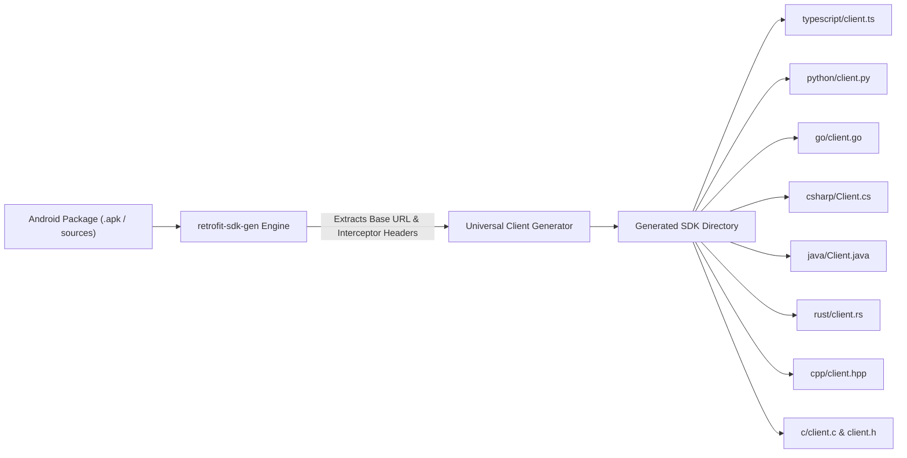

# 🌐 Universal Client Configuration Guide

Every SDK generated by `retrofit-sdk-gen` includes an idiomatic, lightweight HTTP client tailored to the target programming language. The client serves as the central networking and transport engine for all generated API services, managing **base URLs**, **authentication credentials**, **discovered headers**, and **request lifecycle hooks**.

---

## 📑 Table of Contents

1. [Architecture & Generation Lifecycle](#-architecture--generation-lifecycle)
2. [The Non-Destructive Scaffolding Rule](#-the-non-destructive-scaffolding-rule)
3. [Language-by-Language Configuration](#-language-by-language-configuration)
   - [1. TypeScript (`client.ts`)](#1-typescript-clientts)
   - [2. Python (`client.py`)](#2-python-clientpy)
   - [3. Go (`client.go`)](#3-go-clientgo)
   - [4. C# (.NET 8+) (`Client.cs`)](#4-c-net-8-clientcs)
   - [5. Java 11+ (`Client.java`)](#5-java-11-clientjava)
   - [6. Rust (`client.rs`)](#6-rust-clientrs)
   - [7. Modern C++17 (`client.hpp`)](#7-modern-c17-clienthpp)
   - [8. ANSI C99 (`client.h` & `client.c`)](#8-ansi-c99-clienth--clientc)
4. [Advanced Recipes & Customizations](#-advanced-recipes--customizations)
   - [Dynamic Request Signing & Nonces](#dynamic-request-signing--nonces)
   - [Automatic Token Refresh (401 Retry Interceptor)](#automatic-token-refresh-401-retry-interceptor)
   - [HTTP & HTTPS Debugging Proxies](#http--https-debugging-proxies)
5. [Client Feature Matrix](#-client-feature-matrix)

---

## 🏛️ Architecture & Generation Lifecycle

When `retrofit-sdk-gen` scans an Android package or decompiled source folder, it performs static bytecode analysis on both Retrofit interfaces and classes implementing `okhttp3.Interceptor`.



### What `retrofit-sdk-gen` Scaffolds into the Client:
- **Discovered Base URL**: Scans Retrofit builders and endpoint constants to detect the default backend base URL (fallback: `https://api.example.com`).
- **Discovered OkHttp Headers**: Headers found inside app interceptors (e.g. `User-Agent`, `App-Version`, `Client-Id`, `Session-Id`) are automatically populated into the client's default headers dictionary.
- **Smart Auth Helpers**: Detects authorization header conventions (`Authorization`, `Auth-Token`, `X-Api-Key`) and provides helper methods that automatically format Bearer tokens.
- **Dual Invocation Model**: Every language exporter supports both a ready-to-use **Default Singleton** (for quick scripts) and **Isolated Client Instances** (for multi-tenant or multi-account applications).

---

## 🔒 The Non-Destructive Scaffolding Rule

> [!IMPORTANT]
> **Generated client files are NEVER overwritten on subsequent SDK builds.**
>
> When you re-run `npx retrofit-sdk-gen` to pick up newly added endpoints or updated data models from a newer APK version, existing client files (`client.ts`, `client.py`, `client.go`, etc.) are preserved intact.
> 
> You can safely implement custom OAuth2 refresh loops, HMAC request signing, telemetry loggers, or proxy settings directly inside the client file without risk of losing your changes on future regenerations.

---

## 🌍 Language-by-Language Configuration

### 1. TypeScript (`client.ts`)

Built entirely on modern Web Standards (`fetch`, `Headers`, `RequestInit`, `URL`). Zero external npm runtime dependencies.

#### File Path:
```
<output-dir>/client.ts
```

#### Global Configuration:
```typescript
import { defaultClient, UsersService } from "./my-ts-sdk";

// 1. Configure Base URL
defaultClient.baseUrl = "https://api.staging.example.com";

// 2. Set Authentication Token (auto-prefixes 'Bearer ' if missing)
defaultClient.setAuth("eyJhbGciOiJIUzI1NiIsIn...");

// 3. Set Custom or Telemetry Headers
defaultClient.headers["X-Client-Version"] = "1.0.0";
defaultClient.headers["User-Agent"] = "MyApp/1.0 (Android; Mobile)";

// 4. Pre-Request Interceptor Hook (for HMAC, nonces, timestamps)
defaultClient.beforeRequest = async (reqInit: RequestInit, url: URL) => {
  reqInit.headers["X-Timestamp"] = Date.now().toString();
};
```

#### Isolated Multi-Tenant Instance:
```typescript
import { HttpClient } from "./my-ts-sdk/client";
import { UsersService } from "./my-ts-sdk";

// Create an isolated client instance with its own credentials
const tenantClient = new HttpClient("https://tenant-a.api.example.com");
tenantClient.setAuth("tenant_token_abc");

// Pass custom client to service call
const response = await UsersService.getUserProfile(
  { pathParams: { id: "USR_101" } },
  tenantClient
);
```

---

### 2. Python (`client.py`)

Pure standard library client using `urllib.request` and Python `dataclasses`. Requires zero third-party packages (`pip install` not required).

#### File Path:
```
<output-dir>/client.py
```

#### Global Configuration:
```python
from my_python_sdk.client import default_client
from my_python_sdk.services import UsersService

# 1. Configure Base URL
default_client.base_url = "https://api.staging.example.com"

# 2. Set Authentication Token
default_client.set_auth("your_access_token_here")

# 3. Add Custom Headers
default_client.headers["X-App-Version"] = "1.0.0"
default_client.headers["X-Device-Platform"] = "Android"

# 4. Make API Call
response = UsersService.get_user_profile(user_id="USR_101")
if response.ok:
    print("User Data:", response.data)
else:
    print(f"Request failed [{response.status}]: {response.error}")
```

#### Isolated Instance Configuration:
```python
from my_python_sdk.client import HttpClient
from my_python_sdk.services import UsersService

custom_client = HttpClient(base_url="https://tenant-b.api.example.com")
custom_client.set_auth("token_tenant_b")

# Pass custom client to service call
response = UsersService.get_user_profile(client=custom_client, user_id="USR_202")
```

---

### 3. Go (`client.go`)

High-performance, zero-dependency client using standard `net/http` and `context.Context`.

#### File Path:
```
<output-dir>/client.go
```

#### Configuration & Usage:
```go
package main

import (
    "context"
    "fmt"
    "net/http"
    "time"

    sdk "my-go-sdk"
)

func main() {
    // 1. Initialize Client with Base URL
    client := sdk.NewClient("https://api.staging.example.com")

    // 2. Set Authentication Token
    client.SetAuth("your_jwt_or_api_key")

    // 3. Set Custom Request Headers
    client.Headers["X-App-Version"] = "1.0.0"
    client.Headers["X-Device-ID"] = "android-uuid-1234"

    // 4. Tune Network Timeouts or Transport
    client.HTTPClient.Timeout = 15 * time.Second

    // 5. Execute API Call with Context
    ctx, cancel := context.WithTimeout(context.Background(), 5*time.Second)
    defer cancel()

    svc := sdk.NewUsersService(client)
    res, err := svc.GetUserProfile(ctx, map[string]string{
        "id": "USR_101",
    })
    if err != nil {
        panic(err)
    }
    fmt.Printf("Status: %d, Response: %s\n", res.StatusCode, string(res.Body))
}
```

---

### 4. C# (.NET 8+) (`Client.cs`)

Modern async/await client utilizing `System.Net.Http.HttpClient`, `System.Text.Json`, and cancellation tokens.

#### File Path:
```
<output-dir>/Client.cs
```

#### Global Configuration:
```csharp
using System;
using System.Threading.Tasks;
using App.Sdk;

class Program
{
    static async Task Main()
    {
        // 1. Configure Global Default Client
        GlobalSdk.DefaultClient.BaseUrl = "https://api.staging.example.com";
        GlobalSdk.DefaultClient.SetAuth("your_bearer_token");

        // 2. Add Custom Headers
        GlobalSdk.DefaultClient.DefaultHeaders["X-Client-Platform"] = "Android";
        GlobalSdk.DefaultClient.DefaultHeaders["X-Client-Version"] = "1.0.0";

        // 3. Make API Call
        var response = await UsersService.GetUserProfileAsync("USR_101");
        if (response.Ok)
        {
            Console.WriteLine($"User Profile: {response.Data}");
        }
    }
}
```

#### Dependency Injection with `IHttpClientFactory` (ASP.NET Core):
```csharp
// Register in Program.cs:
builder.Services.AddHttpClient("MobileApi", client =>
{
    client.BaseAddress = new Uri("https://api.example.com");
    client.Timeout = TimeSpan.FromSeconds(20);
});

// Inject in your service:
public class AccountManager
{
    private readonly HttpClientWrapper _client;

    public AccountManager(IHttpClientFactory factory)
    {
        var httpClient = factory.CreateClient("MobileApi");
        _client = new HttpClientWrapper("https://api.example.com", httpClient);
        _client.SetAuth("access_token");
    }
}
```

---

### 5. Java 11+ (`Client.java`)

Clean, zero-dependency Java client using standard `java.net.http.HttpClient` with immutable request builders.

#### File Path:
```
<output-dir>/src/main/java/com/app/sdk/Client.java
```

#### Configuration & Usage:
```java
package com.example;

import com.app.sdk.Client;
import com.app.sdk.UsersService;
import com.app.sdk.ApiResponse;
import java.util.Map;

public class Main {
    public static void main(String[] args) {
        // 1. Instantiate Client
        Client client = new Client("https://api.staging.example.com");

        // 2. Configure Authentication Token
        client.setAuth("eyJhbGciOiJIUzI1NiIsIn...");

        // 3. Execute Service Request
        UsersService service = new UsersService(client);
        ApiResponse<String> response = service.getUserProfile(
            Map.of("id", "USR_101"),
            null
        );

        if (response.isSuccess()) {
            System.out.println("Response: " + response.getData());
        } else {
            System.err.println("Failed with status: " + response.getStatusCode());
        }
    }
}
```

---

### 6. Rust (`client.rs`)

Asynchronous, high-performance client powered by `reqwest`, `tokio`, and `serde_json`.

#### File Path:
```
<output-dir>/src/client.rs
```

#### Configuration & Builder Pattern:
```rust
use app_sdk::client::Client;
use app_sdk::services::UsersService;

#[tokio::main]
async fn main() -> Result<(), Box<dyn std::error::Error>> {
    // 1. Create client and configure token via builder pattern
    let client = Client::new(Some("https://api.staging.example.com"))
        .with_token("your_secret_bearer_token");

    // 2. Initialize Service with Client reference
    let service = UsersService::new(&client);

    // 3. Make Request
    let response = service.get_user_profile("USR_101").await?;
    println!("Status Code: {}", response.status());

    let body_text = response.text().await?;
    println!("Body: {}", body_text);

    Ok(())
}
```

---

### 7. Modern C++17 (`client.hpp`)

Header-only C++17 client interface with STL containers and default singleton provider.

#### File Path:
```
<output-dir>/include/client.hpp
```

#### Configuration:
```cpp
#include "client.hpp"
#include <iostream>

int main() {
    // 1. Access Global Singleton Client
    auto& client = app::Client::get_default();
    client.base_url = "https://api.staging.example.com";

    // 2. Set Authentication Token
    client.set_auth("your_auth_token_here");

    // 3. Add Custom Headers
    client.default_headers["X-Client-Type"] = "Desktop-Cpp";
    client.default_headers["X-SDK-Version"] = "1.0.0";

    // 4. Make Request
    app::RequestOptions opts;
    opts.method = "GET";
    opts.endpoint = "/users/profile";
    opts.query_params["id"] = "USR_101";

    app::ApiResponse res = client.request(opts);
    std::cout << "Status: " << res.status_code << "\n";
    std::cout << "Body: " << res.body << "\n";

    return 0;
}
```

---

### 8. ANSI C99 (`client.h` & `client.c`)

Procedural, lightweight C client suitable for embedded systems, microcontrollers, and low-footprint environments.

#### File Paths:
```
<output-dir>/include/client.h
<output-dir>/src/client.c
```

#### Configuration & Lifecycle:
```c
#include "client.h"
#include <stdio.h>

int main(void) {
    // 1. Allocate & Initialize Client
    app_client_t* client = app_client_new("https://api.staging.example.com");
    if (!client) {
        fprintf(stderr, "Failed to initialize client\n");
        return 1;
    }

    // 2. Set Authentication Token (auto-prefixes 'Bearer ')
    app_client_set_auth(client, "your_access_token_here");

    // 3. Add Custom Header
    app_client_add_header(client, "X-Client-Platform", "Embedded-C");

    // 4. Configure Request Options
    app_request_opts_t opts = {0};
    opts.method = "GET";
    opts.endpoint = "/api/v1/config";

    // 5. Execute Request
    app_response_t* resp = app_client_request(client, &opts);
    if (resp && resp->ok) {
        printf("Response Status: %ld\n", resp->status_code);
        printf("Response Body: %s\n", resp->body ? resp->body : "(empty)");
    }

    // 6. Free Allocated Resources
    if (resp) app_response_free(resp);
    app_client_free(client);

    return 0;
}
```

---

## 🛠️ Advanced Recipes & Customizations

Because generated client files are **never overwritten**, you can customize them with production networking capabilities:

### Dynamic Request Signing & Nonces

For APIs that require request verification via an HMAC SHA-256 signature or timestamp nonce:

#### In TypeScript (`client.ts`):
```typescript
import * as crypto from "crypto";

// Hook into beforeRequest to inject dynamic HMAC signature
defaultClient.beforeRequest = async (reqInit, url) => {
  const timestamp = Date.now().toString();
  const secretKey = process.env.API_SIGNING_KEY || "secret_signing_key";
  
  const payloadToSign = `${reqInit.method}:${url.pathname}:${timestamp}`;
  const signature = crypto
    .createHmac("sha256", secretKey)
    .update(payloadToSign)
    .digest("hex");

  reqInit.headers = {
    ...reqInit.headers,
    "X-Request-Timestamp": timestamp,
    "X-Signature": signature,
  };
};
```

---

### Automatic Token Refresh (401 Retry Interceptor)

Automatically refresh expired access tokens without leaking credentials or handling retry logic in service calls:

#### In TypeScript (`client.ts`):
```typescript
// Inside HttpClient.prototype.request:
let res = await fetch(url.toString(), reqInit);

// If unauthorized, refresh token once and retry original request
if (res.status === 401 && !url.pathname.includes("/auth/refresh")) {
  const newAccessToken = await this.refreshToken();
  if (newAccessToken) {
    this.setAuth(newAccessToken);
    reqInit.headers = { ...this.headers, ...options?.headers };
    res = await fetch(url.toString(), reqInit);
  }
}
```

---

### HTTP & HTTPS Debugging Proxies

Route SDK network traffic through debugging tools such as Fiddler, Charles, or mitmproxy:

#### In Python (`client.py`):
```python
import os

# Standard urllib respects HTTP_PROXY and HTTPS_PROXY environment variables:
os.environ["HTTPS_PROXY"] = "http://127.0.0.1:8888"
```

#### In Go (`client.go`):
```go
proxyURL, _ := url.Parse("http://127.0.0.1:8888")
client.HTTPClient.Transport = &http.Transport{
    Proxy: http.ProxyURL(proxyURL),
}
```

---

## 📊 Client Feature Matrix

| Language | Client File | Default Singleton | Auth Helper | Custom Headers | Non-Destructive Preservation |
| :--- | :--- | :---: | :---: | :---: | :---: |
| **TypeScript** | `client.ts` | `defaultClient` | `setAuth(token)` | `headers["Key"] = val` | ✅ **Never Overwritten** |
| **Python** | `client.py` | `default_client` | `set_auth(token)` | `headers["Key"] = val` | ✅ **Never Overwritten** |
| **Go** | `client.go` | `NewClient("")` | `SetAuth(token)` | `Headers["Key"] = val` | ✅ **Never Overwritten** |
| **C#** | `Client.cs` | `GlobalSdk.DefaultClient` | `SetAuth(token)` | `DefaultHeaders["Key"] = val` | ✅ **Never Overwritten** |
| **Java** | `Client.java` | `new Client()` | `setAuth(token)` | `defaultHeaders.put(...)` | ✅ **Never Overwritten** |
| **Rust** | `client.rs` | `Client::default()` | `with_token(token)` | `headers.insert(...)` | ✅ **Never Overwritten** |
| **C++** | `client.hpp` | `Client::get_default()` | `set_auth(token)` | `default_headers["Key"] = val` | ✅ **Never Overwritten** |
| **ANSI C** | `client.h` | `app_client_new(...)`| `app_client_set_auth(...)` | `app_client_add_header(...)` | ✅ **Never Overwritten** |
