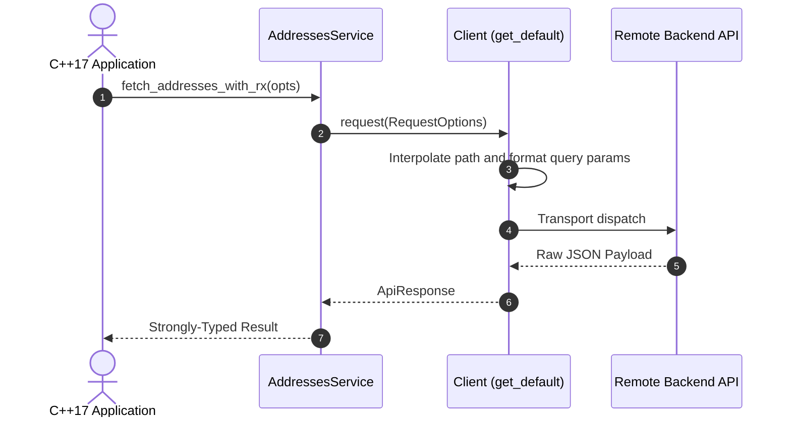

# 🔷 Modern C++17 SDK Guide

The generated C++ SDK is a clean, modern header-only library (`.hpp`) designed for easy integration into existing C++17 / C++20 projects without link headaches.

---

## 📁 Directory Structure

```
sdk/cpp/
├── CMakeLists.txt     # Interface library target for CMake
└── include/
    ├── client.hpp     # app::Client and RequestOptions
    ├── models.hpp     # 386+ Strongly-typed C++17 structs in app::models
    ├── services.hpp   # 94 Service classes with namespaced methods
    └── sdk.hpp        # Master convenience include header
```

---

## 🚀 Getting Started

### 1. Generating the SDK

```bash
npx retrofit-sdk-gen ./app.apk --lang cpp --output ./my-cpp-sdk
```

### 2. Including in CMake

```cmake
add_subdirectory(my-cpp-sdk)
target_link_libraries(my_application PRIVATE app_sdk)
```

---

## 💡 Making API Calls



```cpp
#include "sdk.hpp"
#include <iostream>

int main() {
    // 1. Initialize client
    app::Client client("https://api.example.com");
    client.set_auth("your_access_token_here");

    // 2. Initialize service
    app::AddressesService addresses_service(client);

    // 3. Make request with query parameters
    app::ApiResponse resp = addresses_service.fetch_addresses_with_rx(
        /* payload */ "",
        /* query_params */ {{"check_pin", "true"}, {"context", "checkout"}}
    );

    if (resp.ok) {
        std::cout << "Status: " << resp.status_code << "\n";
        std::cout << "Body: " << resp.body << "\n";
    } else {
        std::cerr << "Error: " << resp.error << "\n";
    }

    return 0;
}
```
