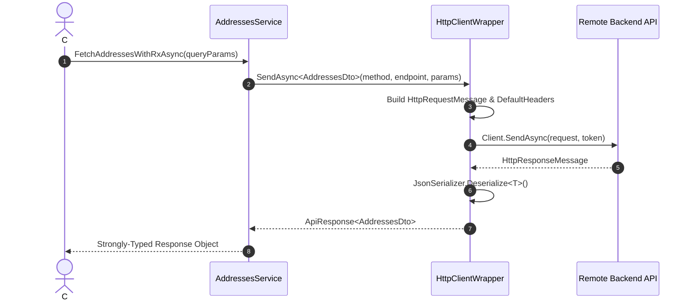

# 🟣 C# (.NET 8) SDK Guide

The generated C# SDK is a modern, strongly-typed .NET 8 class library powered by `System.Net.Http.HttpClient` and `System.Text.Json` with full async/await and cancellation token support.

---

## 📁 Directory Structure

```
sdk/csharp/
├── Client.cs          # HttpClientWrapper, RequestOptions, discovered OkHttp headers, SetAuth
├── Models.cs          # 386+ Strongly-typed C# record models with JsonPropertyName
├── Services.cs        # 94 Service classes with Task<ApiResponse<T>> methods
└── AppSdk.csproj      # Standalone .NET 8 class library project file
```

---

## 🚀 Getting Started

### 1. Generating the SDK

```bash
npx retrofit-sdk-gen ./app.apk --lang csharp --output ./my-csharp-sdk
```

### 2. Building the Project

```bash
cd my-csharp-sdk
dotnet build
```

---

## 💡 Making API Calls



### 1. Basic Request with Authentication
```csharp
using System;
using System.Collections.Generic;
using System.Threading.Tasks;
using App.Sdk;

class Program
{
    static async Task Main()
    {
        // 1. Initialize client
        var client = GlobalSdk.DefaultClient;
        client.SetAuth("your_access_token_here");

        // 2. Initialize service
        var addressesService = new AddressesServiceService(client);

        // 3. Make typed asynchronous request
        var queryParams = new Dictionary<string, object>
        {
            ["check_pin"] = true,
            ["context"] = "checkout"
        };

        var response = await addressesService.FetchAddressesWithRxAsync<Dictionary<string, object>>(queryParams);

        if (response.Ok)
        {
            Console.WriteLine($"Status: {response.StatusCode}");
            Console.WriteLine($"Body: {response.RawText}");
        }
        else
        {
            Console.WriteLine($"Error: {response.Error}");
        }
    }
}
```

### 2. Post Requests with Payloads & Cancellation Tokens
```csharp
using System.Threading;

var cts = new CancellationTokenSource(TimeSpan.FromSeconds(15));
var payoutService = new PayoutServiceService(client);

var payload = new
{
    amount = 500,
    upi_id = "user@upi"
};

var response = await payoutService.FetchRefundModesWithChecksV2Async<object>(
    payload: payload,
    cancellationToken: cts.Token
);
```

---

## 🛡️ Response Model (`ApiResponse<T>`)

```csharp
public class ApiResponse<T>
{
    public bool Ok { get; set; }
    public int StatusCode { get; set; }
    public T? Data { get; set; }
    public string? RawText { get; set; }
    public HttpResponseHeaders? Headers { get; set; }
    public string? Error { get; set; }
}
```
