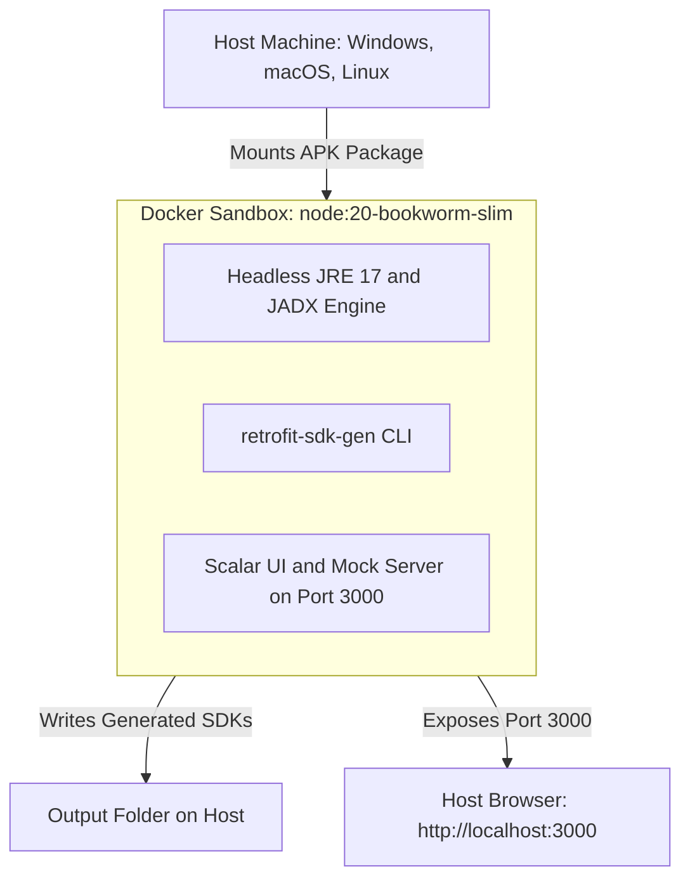

# 🐳 Docker & Container Deployment Guide

`retrofit-sdk-gen` provides a multi-stage, zero-config Docker setup that enables you to decompile Android applications, generate production-ready multi-language SDKs, and run the interactive Scalar API Playground with **zero host dependencies** (no local Node.js, Java, or JADX required).

---

## 📑 Table of Contents

1. [Architecture Overview](#-architecture-overview)
2. [Multi-Stage Targets](#-multi-stage-targets)
3. [Quick Start (Docker CLI)](#-quick-start-docker-cli)
   - [1. Building the Image](#1-building-the-image)
   - [2. Generating SDKs](#2-generating-sdks)
   - [3. Running the Scalar Playground & Mock Server](#3-running-the-scalar-playground--mock-server)
   - [4. Auditing OkHttp Security](#4-auditing-okhttp-security)
4. [Using Docker Compose](#-using-docker-compose)
   - [Directory Structure](#directory-structure)
   - [Booting the Playground](#booting-the-playground)
   - [One-Command SDK Generation](#one-command-sdk-generation)
   - [Automated Native Compiler Verification](#automated-native-compiler-verification)
5. [Cross-Platform Volume Mount Cheatsheet](#-cross-platform-volume-mount-cheatsheet)

---

## 🏛️ Architecture Overview

The Docker container encapsulates both the **Node.js 20 LTS runtime** and a **headless OpenJDK 17 JRE**, enabling JADX to decompile packages inside an isolated sandbox.



---

## 🎯 Multi-Stage Targets

The [`Dockerfile`](../Dockerfile) defines two key stages:

| Target | Image Tag | Size | Included Toolchains | Intended Use Case |
| :--- | :--- | :---: | :--- | :--- |
| **`runtime`** (Default) | `retrofit-sdk-gen:latest` | ~250MB | Node.js 20, OpenJDK 17 Headless, JADX auto-downloader, curl | Everyday SDK generation, API Playground, mock server |
| **`full-test`** | `retrofit-sdk-gen:full-test` | ~1.8GB | All `runtime` tools + Python 3, Go 1.22, .NET 8 SDK, Rust/Cargo, GCC, Make, CMake | Automated 4-stage verification across all native compilers |

---

## ⚡ Quick Start (Docker CLI)

### 1. Building the Image

Build the lightweight production runtime image:

```bash
docker build -t retrofit-sdk-gen:latest .
```

To build the full compiler verification image:
```bash
docker build --target full-test -t retrofit-sdk-gen:full-test .
```

---

### 2. Generating SDKs

Mount your local directory containing the APK and specify an output folder:

```bash
docker run --rm \
  -v "$(pwd)/app.apk:/work/app.apk:ro" \
  -v "$(pwd)/output:/output" \
  retrofit-sdk-gen:latest /work/app.apk -o /output --lang all --openapi --postman
```

#### Explanation of flags:
* `-v "$(pwd)/app.apk:/work/app.apk:ro"`: Mounts your APK into the container as read-only.
* `-v "$(pwd)/output:/output"`: Mounts a host folder to receive the generated SDKs.
* `--lang all --openapi --postman`: Instructs the generator to emit all 8 languages + specifications.

---

### 3. Running the Scalar Playground & Mock Server

Boot the local interactive API dashboard and synthetic mock engine on port `3000`:

```bash
docker run --rm -it \
  -p 3000:3000 \
  -v "$(pwd)/app.apk:/work/app.apk:ro" \
  retrofit-sdk-gen:latest serve /work/app.apk --port 3000
```

Once started, navigate to **`http://localhost:3000`** in your browser to test endpoints and copy code snippets.

---

### 4. Auditing OkHttp Security

Run the static OkHttp Interceptor audit against an APK without generating files:

```bash
docker run --rm \
  -v "$(pwd)/app.apk:/work/app.apk:ro" \
  retrofit-sdk-gen:latest security /work/app.apk
```

---

## 🐙 Using Docker Compose

For repetitive workflows, use the pre-configured [`docker-compose.yml`](../docker-compose.yml):

### Directory Structure

Create a `packages/` folder and place your target APK there:

```
my-project/
├── docker-compose.yml
├── packages/
│   └── app.apk        <-- Put your APK here (named app.apk)
└── output/            <-- Generated SDKs will appear here
```

### Booting the Playground

```bash
docker compose up playground
```
Open **`http://localhost:3000`** in your browser. Stop the server anytime with `Ctrl+C`.

### One-Command SDK Generation

```bash
docker compose run --rm generate
```
This automatically decompiles `/packages/app.apk` and writes all 8 language SDKs, OpenAPI 3.0 specs, and Postman collections into `./output/`.

### Automated Native Compiler Verification

Run the 4-stage verification suite across all 8 language compilers:

```bash
docker compose run --rm test-apk
```

---

## 💻 Cross-Platform Volume Mount Cheatsheet

Depending on your shell, use the corresponding syntax for volume mounting current directory `$(pwd)`:

### Bash / Zsh (macOS / Linux):
```bash
docker run --rm -v "$(pwd):/work" -w /work retrofit-sdk-gen:latest app.apk -o ./output
```

### PowerShell (Windows):
```powershell
docker run --rm -v "${PWD}:/work" -w /work retrofit-sdk-gen:latest app.apk -o ./output
```

### Windows Command Prompt (`cmd.exe`):
```cmd
docker run --rm -v "%cd%:/work" -w /work retrofit-sdk-gen:latest app.apk -o ./output
```
