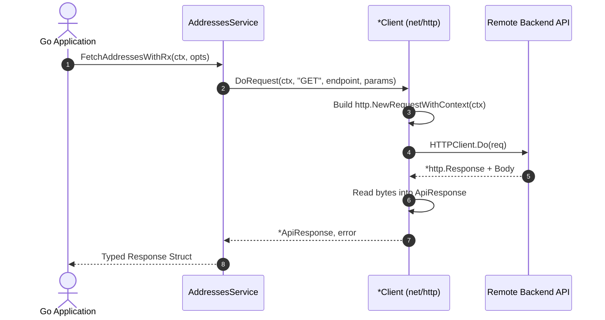

# 🐹 Go (Golang) SDK Guide

The generated Go SDK is a 100% standard library package (`net/http`) with zero external dependencies, strongly-typed structs, and standard `context.Context` cancellation support.

---

## 📁 Directory Structure

```
sdk/go/
├── client.go      # Client struct, NewClient, Request dispatcher, discovered OkHttp headers
├── models.go      # 386+ Strongly-typed Go structs with json tags
├── services.go    # 94 Service structs with PascalCase methods and context.Context
└── go.mod         # Standalone Go module manifest
```

---

## 🚀 Getting Started

### 1. Generating the SDK

```bash
npx retrofit-sdk-gen ./app.apk --lang go --output ./my-go-sdk
```

### 2. Importing & Global Configuration

```go
package main

import (
    "context"
    "fmt"
    "time"
    "my-go-sdk"
)

func main() {
    // 1. Create client
    client := sdk.NewClient("https://api.example.com")

    // 2. Set authentication token
    client.SetAuth("your_access_token_here")

    // 3. Inject custom tracking headers
    client.Headers["X-Client-Version"] = "1.0.0"

    // 4. Initialize service
    addressesService := sdk.NewAddressesServiceService(client)
```

---

## 💡 Making API Calls



### 1. Context Cancellation & Query Parameters
```go
    ctx, cancel := context.WithTimeout(context.Background(), 10*time.Second)
    defer cancel()

    queryParams := map[string]interface{}{
        "check_pin": true,
        "context":   "checkout",
    }

    resp, err := addressesService.FetchAddressesWithRx(ctx, queryParams)
    if err != nil {
        panic(err)
    }

    if resp.Ok {
        fmt.Printf("HTTP %d: %s\n", resp.StatusCode, string(resp.Body))
    } else {
        fmt.Printf("Request failed with status %d\n", resp.StatusCode)
    }
```

### 2. POST Endpoints with Request Payloads
```go
    payoutService := sdk.NewPayoutServiceService(client)

    payload := map[string]interface{}{
        "account_validation": true,
        "upi_id":             "user@bank",
    }

    resp, err := payoutService.FetchRefundModesWithChecksV2(ctx, payload)
    if err == nil && resp.Ok {
        fmt.Println("Payout advisory received successfully")
    }
```

---

## 🛡️ Response Structure (`ApiResponse`)

```go
type ApiResponse struct {
    Ok         bool                // True if HTTP 200-299
    StatusCode int                 // HTTP status code
    Body       []byte              // Raw response bytes
    Headers    map[string][]string // Response headers
}
```
