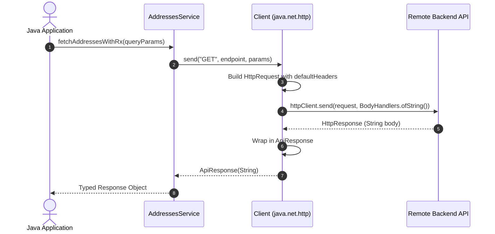

# ☕ Java (11+) SDK Guide

The generated Java SDK is a zero-dependency client built entirely on Java 11's standard `java.net.http.HttpClient`. It contains zero external JARs and can be directly included in Spring Boot, Quarkus, Android, or standalone Java applications.

---

## 📁 Directory Structure

```
sdk/java/
├── Client.java        # Standard Java 11 HttpClient wrapper with discovered OkHttp headers
├── ApiResponse.java   # Generic response container
├── Models.java        # 386+ Strongly-typed Java POJOs with getters & setters
├── Services.java      # 94 Service classes with static and instance methods
└── pom.xml            # Clean Maven project descriptor
```

---

## 🚀 Getting Started

### 1. Generating the SDK

```bash
npx retrofit-sdk-gen ./app.apk --lang java --output ./my-java-sdk
```

### 2. Maven Build

```bash
cd my-java-sdk
mvn clean compile
```

---

## 💡 Making API Calls



### 1. Basic Request with Authentication
```java
package com.example;

import com.app.sdk.Client;
import com.app.sdk.ApiResponse;
import com.app.sdk.AddressesServiceService;
import java.util.Map;

public class Main {
    public static void main(String[] args) {
        // 1. Create client
        Client client = new Client("https://api.example.com");
        client.setAuth("your_access_token_here");

        // 2. Initialize service
        AddressesServiceService addressesService = new AddressesServiceService(client);

        // 3. Make synchronous HTTP call
        Map<String, Object> queryParams = Map.of(
            "check_pin", true,
            "context", "checkout"
        );

        ApiResponse<String> response = addressesService.fetchAddressesWithRx(queryParams);

        if (response.isOk()) {
            System.out.println("HTTP " + response.getStatusCode() + ": " + response.getData());
        } else {
            System.err.println("Request failed: " + response.getError());
        }
    }
}
```

### 2. POST Requests with JSON Payloads
```java
import com.app.sdk.PayoutServiceService;

PayoutServiceService payoutService = new PayoutServiceService(client);
String jsonPayload = "{\"amount\": 499.00, \"mode\": \"IMPS\"}";

ApiResponse<String> response = payoutService.fetchRefundModesWithChecksV2(jsonPayload);
```

---

## 🛡️ Response Model (`ApiResponse<T>`)

```java
public class ApiResponse<T> {
    public boolean isOk();
    public int getStatusCode();
    public T getData();
    public String getError();
}
```
