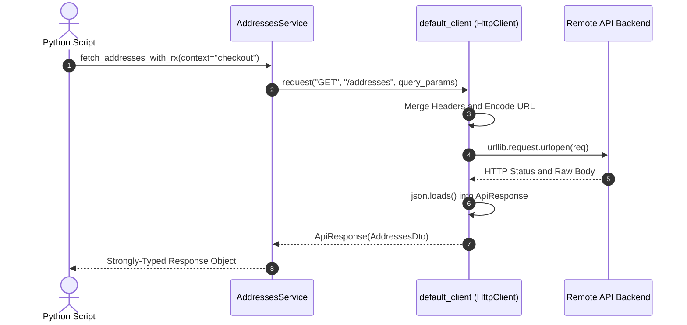

# 🐍 Python SDK Guide

The generated Python SDK produces clean, idiomatic Python code with type annotations, `snake_case` methods, and zero third-party requirements (using Python's standard library `urllib`, compatible with `httpx` or `requests`).

---

## 📁 Directory Structure

```
sdk/python/
├── __init__.py    # Package exports
├── client.py      # Universal HttpClient with discovered OkHttp headers and auth helpers
├── models.py      # 386+ Strongly-typed Python dataclasses reconstructed from Java DTOs
└── services.py    # 94 Service classes with idiomatic snake_case methods
```

---

## 🚀 Getting Started

### 1. Generating the SDK

```bash
npx retrofit-sdk-gen ./app.apk --lang python --output ./my-python-sdk
```

### 2. Importing & Global Configuration

```python
from my_python_sdk.client import default_client
from my_python_sdk.services import AddressesService, PayoutService

# Set Base URL
default_client.base_url = "https://api.example.com"

# Set Global Authentication Token
default_client.set_auth("your_access_token_here")

# Set Custom Header
default_client.headers["X-Client-Version"] = "1.0.0"
```

---

## 💡 Making API Calls



### 1. Endpoints with Query Parameters
```python
from my_python_sdk.services import AddressesService

# Call method with keyword arguments
response = AddressesService.fetch_addresses_with_rx(
    context="checkout",
    check_pin=True,
)

if response.ok:
    print("Addresses:", response.data)
else:
    print(f"Error {response.status}: {response.error}")
```

### 2. Endpoints with Path Parameters & Payload
```python
from my_python_sdk.services import PayoutService

response = PayoutService.update_refund_modes(
    payload={
        "refund_mode": "BANK_TRANSFER",
        "account_id": "ACC_12345",
    }
)
```

### 3. Using a Custom Client Instance
For multi-tenant applications or distinct credentials per request:
```python
from my_python_sdk.client import HttpClient
from my_python_sdk.services import AddressesService

custom_client = HttpClient(base_url="https://staging.api.example.com")
custom_client.set_auth("staging_token_xyz")

response = AddressesService.fetch_addresses_with_rx(
    client=custom_client,
    context="cart",
)
```

---

## 🛡️ Response Model (`ApiResponse[T]`)

```python
class ApiResponse(Generic[T]):
    ok: bool             # True if HTTP status is 200-299
    status: int          # HTTP status code
    data: Optional[T]    # Parsed JSON dictionary or list
    headers: Optional[Dict[str, str]] # Response headers
    error: Optional[str] # Error message if request failed
```
